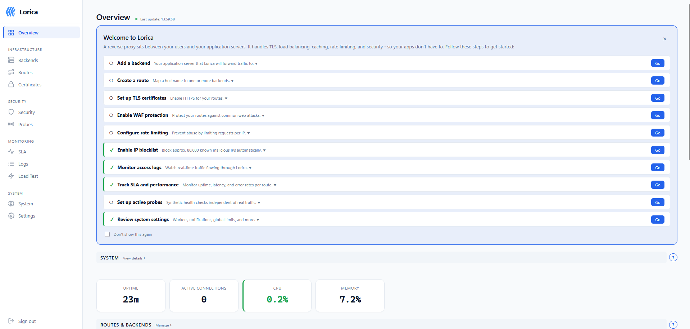
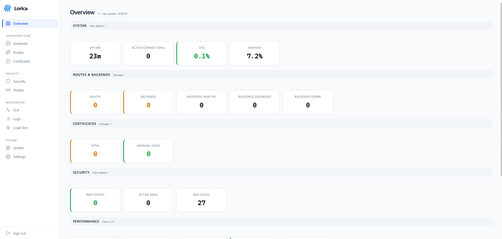
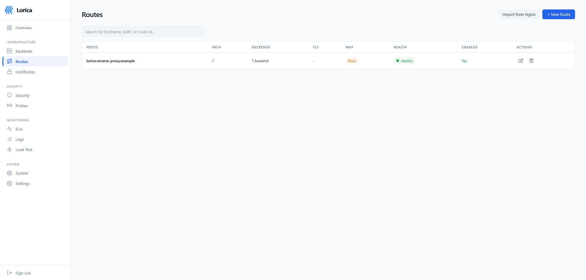
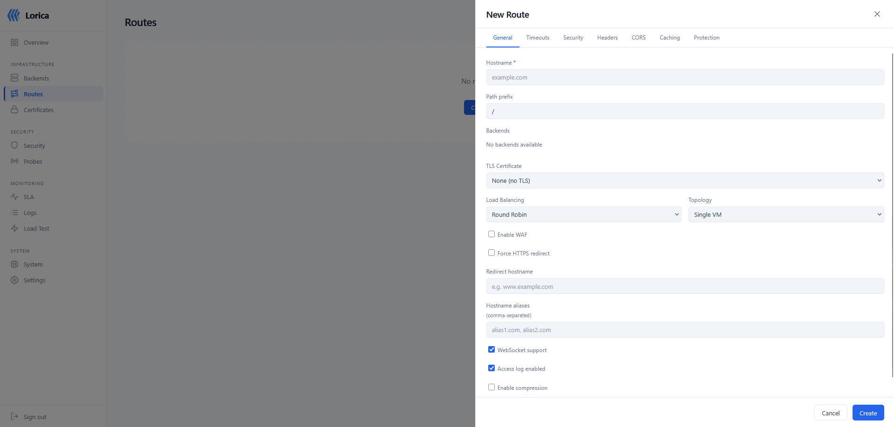
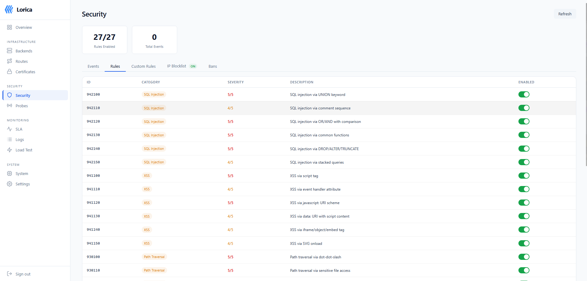
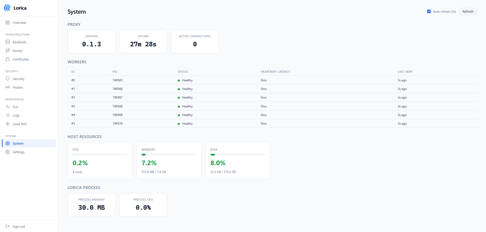

<p align="center">
  
  <h1 align="center">Lorica</h1>
  <p align="center"><strong>A modern, secure, dashboard-first reverse proxy built in Rust</strong></p>
</p>

<p align="center">
  <a href="LICENSE"></a>
  
  
  
  
  
</p>

---

Lorica is a production-ready reverse proxy with a built-in web dashboard, WAF, SLA monitoring, and HTTP caching. One binary, zero external dependencies. Install it, open your browser, and manage everything from the UI - routes, backends, certificates, security rules, and performance metrics.

Built on [Cloudflare Pingora](https://github.com/cloudflare/pingora), the engine that powers a significant portion of Cloudflare's CDN traffic.

## Key Features

### :shield: Proxy & Routing

- HTTP/HTTPS reverse proxy with host-based and path-prefix routing
- **Path rules** - ordered sub-path overrides within a route for backends, cache, headers, rate limits, or direct HTTP status responses
- TLS termination via rustls (no OpenSSL dependency)
- SNI-based certificate selection with wildcard domain support (`*.example.com`)
- Path rewriting (strip/add prefix, regex with capture groups), hostname aliases, HTTP-to-HTTPS redirect
- Catch-all hostname (`_`) as last-resort fallback, `redirect_to` for domain redirects, `return_status` for direct responses
- Configurable proxy headers, per-route timeouts, WebSocket passthrough, X-Forwarded-Proto via TLS session detection
- Connection pooling with health-aware backend filtering

### :lock: Security

- **WAF engine** - 39 OWASP CRS-inspired rules (SQLi, XSS, path traversal, command injection, SSRF, Log4Shell, XXE, CRLF)
- **IP blocklist** - auto-fetched from Data-Shield IPv4 Blocklist (~80,000 entries, O(1) lookup, updated every 6h)
- **Rate limiting** - per-route, per-client-IP with configurable RPS and burst tolerance
- **Auto-ban** - IPs that repeatedly exceed rate limits are banned automatically (configurable threshold and duration)
- **Trusted proxies** - CIDR list for X-Forwarded-For validation, prevents IP spoofing via header injection
- **DDoS protection** - per-route max connections, global flood rate tracking
- **Slowloris detection** - rejects slow-header attacks with configurable threshold
- **Security headers** - presets (strict/moderate/none) with HSTS, CSP, X-Frame-Options, X-Content-Type-Options
- **IP allowlist/denylist** and **CORS configuration** per route

### :bar_chart: Monitoring & Observability

- **Passive SLA** - per-route uptime, latency percentiles (p50/p95/p99), rolling windows (1h/24h/7d/30d)
- **Active SLA** - synthetic HTTP probes at configurable intervals, detects outages during low-traffic periods
- **Prometheus metrics** - `/metrics` endpoint with request counts, latency histograms, backend health, WAF events, cert expiry
- **Real-time access logs** - WebSocket streaming to the dashboard with filtering
- **Load testing** - built-in load test engine with SSE streaming, cron scheduling, CPU circuit breaker, and result comparison
- **SLA breach alerts** - automatic notifications when SLA drops below target

### :globe_with_meridians: Management

- **Web dashboard** - Svelte 5 UI (~59 KB) embedded in the binary: routes, backends, certs, WAF, SLA, load tests, settings
- **REST API** - full CRUD for all entities, session-based auth, rate-limited login
- **TOML config export/import** - with diff preview before applying changes
- **Nginx config import** - paste an `nginx.conf` to auto-create routes, backends, certificates, and path rules with cert import support
- **ACME / Let's Encrypt** - automatic TLS provisioning via HTTP-01 and DNS-01 challenges (Cloudflare, Route53, OVH providers), multi-domain SAN and wildcard support, smart auto-renewal
- **DNS providers** - global DNS credentials configured once in Settings and referenced by ID for certificate provisioning (Cloudflare, Route53, OVH)
- **Notification channels** - stdout, SMTP email, HTTP webhook, Slack with per-channel rate limiting
- **Ban list management** - view and unban auto-banned IPs from the dashboard

### :zap: Performance

- **Pingora engine** - forked from Cloudflare's production proxy framework
- **HTTP cache** - in-memory response caching with LRU eviction (128 MiB cap), TinyUFO algorithm
- **Peak EWMA load balancing** - latency-aware backend selection alongside Round Robin, Consistent Hash, Random
- **DashMap** - lock-free concurrent reads for ban list and route connections in the hot path
- **Sub-0.5ms WAF evaluation** - precompiled regex patterns with zero overhead when disabled

### :package: Reliability

- **Worker process isolation** - fork+exec with socket passing via SCM_RIGHTS
- **Protobuf command channel** - supervisor-to-worker config reload without traffic interruption
- **Health checks** - TCP and HTTP probes, backends marked degraded (>2s) or down and removed from rotation
- **Graceful drain** - per-backend active connection tracking with Closing/Closed lifecycle states
- **Certificate hot-swap** - atomic swap via arc-swap, zero downtime during rotation
- **Encrypted storage** - AES-256-GCM encryption for certificate private keys at rest

## Quick Start

### Install from .deb package

```bash
# Download the latest release
wget https://github.com/Rwx-G/Lorica/releases/latest/download/lorica.deb
sudo dpkg -i lorica.deb
sudo systemctl enable --now lorica
```

### Run directly

```bash
lorica --data-dir /var/lib/lorica
```

Open `https://localhost:9443` in your browser. On first run, a random admin password is printed to stdout.

### CLI options

```
lorica [OPTIONS]

Options:
  --data-dir <PATH>          Data directory (default: /var/lib/lorica)
  --management-port <PORT>   Dashboard/API port (default: 9443)
  --http-port <PORT>         HTTP proxy port (default: 8080)
  --https-port <PORT>        HTTPS proxy port (default: 8443)
  --workers <N>              Worker processes (default: 0 = single-process)
  --log-level <LEVEL>        Log level (default: info)
  --version                  Print version
```

## Dashboard

The dashboard ships inside the binary and is served on the management port (default 9443). No separate frontend server, no npm, no build step - just open your browser.

<p align="center">
  
  <br><em>Getting started guide with interactive setup checklist</em>
</p>

<p align="center">
  
  <br><em>Overview cockpit with system health, routes, security, and performance at a glance</em>
</p>

<p align="center">
  
  <br><em>Routes table with hostname, backends, WAF mode, health status, and TLS</em>
</p>

<p align="center">
  
  <br><em>Route editor with 25+ settings across 7 tabs (General, Timeouts, Security, Headers, CORS, Caching, Protection)</em>
</p>

<p align="center">
  
  <br><em>39 WAF rules with per-rule toggle, covering SQLi, XSS, SSRF, Log4Shell, XXE, and more</em>
</p>

<p align="center">
  
  <br><em>System page with worker health, heartbeat latency, CPU/memory gauges, and process metrics</em>
</p>

### Pages

- **Overview** - cockpit dashboard with section helpers, setup checklist, system/route/security/performance cards
- **Routes** - create/edit routes with host matching, path prefixes, load balancing, WAF mode, rate limits, caching, timeouts, security headers, CORS, and 25 other per-route settings
- **Backends** - manage backend addresses, weights, health check type (TCP/HTTP), TLS upstream, active connections
- **Certificates** - upload PEM certificates, view expiry dates, provision via ACME/Let's Encrypt (HTTP-01, DNS-01)
- **Security** - WAF event table with category filtering, 39 rule toggles, IP ban list with unban button
- **SLA** - per-route passive/active SLA side-by-side, latency percentile tables, config editor, CSV/JSON export
- **Load Tests** - test config management with clone, one-click execution, real-time SSE progress panel, historical results
- **Active Probes** - CRUD for synthetic health probes with route selection, HTTP method/path/status/interval/timeout
- **Access Logs** - scrollable real-time log stream via WebSocket with green pulsing indicator
- **System** - worker table with PID, health, heartbeat latency; CPU/memory/disk gauges
- **Settings** - notification channels, security header presets, config export/import with diff preview
- **Theme** - light/dark mode toggle

## Architecture

Lorica is a Rust workspace with 25 crates: 15 forked from Cloudflare Pingora and 10 product crates. See [FORK.md](FORK.md) for the full fork lineage and renaming rules.

| Crate | Purpose |
|-------|---------|
| `lorica` | CLI binary, supervisor, worker orchestration |
| `lorica-proxy` | HTTP/HTTPS proxy engine (Pingora fork) |
| `lorica-tls` | SNI certificate resolver, hot-swap, ACME |
| `lorica-config` | SQLite store, migrations, TOML export/import |
| `lorica-api` | axum REST API, auth, session management |
| `lorica-dashboard` | Svelte 5 frontend embedded via rust-embed |
| `lorica-waf` | WAF engine, OWASP rules, IP blocklist |
| `lorica-notify` | Alert dispatch (stdout, SMTP, webhook) |
| `lorica-bench` | SLA monitoring, load testing engine |
| `lorica-worker` | fork+exec worker isolation, socket passing |
| `lorica-command` | Protobuf supervisor-worker command channel |
| `lorica-lb` | Load balancing (Round Robin, Peak EWMA, Hash, Random) |
| `lorica-cache` | HTTP response cache, LRU eviction |
| `lorica-limits` | Rate estimator for rate limiting |

Data plane (proxy) and control plane (API/dashboard) are fully separated. API mutations trigger config reload via arc-swap - the proxy picks up changes without restarting.

## Performance

Measured on a single Linux VM (4 vCPU, 8 GB RAM):

| Metric | Value |
|--------|-------|
| Single-process throughput | ~6,500 req/s |
| Multi-worker throughput (4 workers) | ~25,000 req/s |
| WAF evaluation latency | < 0.5 ms per request |
| WAF overhead on throughput | ~6% |
| Dashboard bundle size | ~59 KB (gzipped) |
| Config reload | Zero-downtime (arc-swap) |
| Certificate hot-swap | Zero-downtime (atomic) |

## Configuration Example

Create a route via the REST API:

```bash
# Authenticate
TOKEN=$(curl -sk https://localhost:9443/api/v1/auth/login \
  -H 'Content-Type: application/json' \
  -d '{"password":"your-admin-password"}' \
  -c - | grep session | awk '{print $NF}')

# Create a backend
curl -sk https://localhost:9443/api/v1/backends \
  -b "session=$TOKEN" \
  -H 'Content-Type: application/json' \
  -d '{
    "address": "127.0.0.1:8080",
    "health_check_interval_s": 10,
    "health_check_type": "http",
    "health_check_path": "/healthz"
  }'

# Create a route
curl -sk https://localhost:9443/api/v1/routes \
  -b "session=$TOKEN" \
  -H 'Content-Type: application/json' \
  -d '{
    "hostname": "app.example.com",
    "path_prefix": "/",
    "backend_ids": [1],
    "load_balancing": "peak_ewma",
    "tls_enabled": true,
    "certificate_id": 1,
    "waf_enabled": true,
    "waf_mode": "block",
    "rate_limit_rps": 100,
    "rate_limit_burst": 50,
    "cache_enabled": true,
    "cache_ttl_s": 300,
    "force_https": true,
    "security_headers": "strict"
  }'
```

Or just use the dashboard - it covers all the same operations with zero curl.

## REST API Reference

All endpoints are served on the management port (default `9443`) over HTTPS. Protected endpoints require a session cookie obtained via `/api/v1/auth/login`.

### Public endpoints

| Method | Path | Description |
|--------|------|-------------|
| `POST` | `/api/v1/auth/login` | Authenticate (returns session cookie) |
| `POST` | `/api/v1/auth/logout` | Invalidate session |
| `GET` | `/metrics` | Prometheus metrics (no auth) |
| `GET` | `/.well-known/acme-challenge/:token` | ACME HTTP-01 challenge response |

### Routes

| Method | Path | Description |
|--------|------|-------------|
| `GET` | `/api/v1/routes` | List all routes |
| `POST` | `/api/v1/routes` | Create route |
| `GET` | `/api/v1/routes/:id` | Get route |
| `PUT` | `/api/v1/routes/:id` | Update route |
| `DELETE` | `/api/v1/routes/:id` | Delete route |

### Backends

| Method | Path | Description |
|--------|------|-------------|
| `GET` | `/api/v1/backends` | List all backends |
| `POST` | `/api/v1/backends` | Create backend |
| `GET` | `/api/v1/backends/:id` | Get backend |
| `PUT` | `/api/v1/backends/:id` | Update backend |
| `DELETE` | `/api/v1/backends/:id` | Delete backend |

### Certificates

| Method | Path | Description |
|--------|------|-------------|
| `GET` | `/api/v1/certificates` | List certificates |
| `POST` | `/api/v1/certificates` | Upload PEM certificate |
| `POST` | `/api/v1/certificates/self-signed` | Generate self-signed certificate |
| `GET` | `/api/v1/certificates/:id` | Get certificate |
| `PUT` | `/api/v1/certificates/:id` | Update certificate |
| `DELETE` | `/api/v1/certificates/:id` | Delete certificate |

### ACME

| Method | Path | Description |
|--------|------|-------------|
| `POST` | `/api/v1/acme/provision` | Provision via HTTP-01 |
| `POST` | `/api/v1/acme/provision-dns` | Provision via DNS-01 |
| `POST` | `/api/v1/acme/provision-dns-manual` | Start manual DNS-01 flow |
| `POST` | `/api/v1/acme/provision-dns-manual/confirm` | Confirm manual DNS-01 |

### WAF

| Method | Path | Description |
|--------|------|-------------|
| `GET` | `/api/v1/waf/events` | Recent WAF events (with category filter) |
| `DELETE` | `/api/v1/waf/events` | Clear WAF events |
| `GET` | `/api/v1/waf/stats` | WAF statistics |
| `GET` | `/api/v1/waf/rules` | List WAF rules |
| `PUT` | `/api/v1/waf/rules/:id` | Enable/disable rule |
| `GET` | `/api/v1/waf/rules/custom` | List custom rules |
| `POST` | `/api/v1/waf/rules/custom` | Create custom rule |
| `DELETE` | `/api/v1/waf/rules/custom/:id` | Delete custom rule |
| `GET` | `/api/v1/waf/blocklist` | Blocklist status |
| `PUT` | `/api/v1/waf/blocklist` | Enable/disable blocklist |
| `POST` | `/api/v1/waf/blocklist/reload` | Reload blocklist |

### SLA & Probes

| Method | Path | Description |
|--------|------|-------------|
| `GET` | `/api/v1/sla/overview` | SLA overview for all routes |
| `GET` | `/api/v1/sla/routes/:id` | SLA metrics for route |
| `GET` | `/api/v1/sla/routes/:id/buckets` | Time-bucketed SLA data |
| `GET` | `/api/v1/sla/routes/:id/config` | SLA config |
| `PUT` | `/api/v1/sla/routes/:id/config` | Update SLA config |
| `GET` | `/api/v1/sla/routes/:id/export` | Export SLA data (CSV/JSON) |
| `GET` | `/api/v1/sla/routes/:id/active` | Active probe results |
| `GET` | `/api/v1/probes` | List probes |
| `POST` | `/api/v1/probes` | Create probe |
| `GET` | `/api/v1/probes/route/:route_id` | Probes for route |
| `PUT` | `/api/v1/probes/:id` | Update probe |
| `DELETE` | `/api/v1/probes/:id` | Delete probe |

### Load Testing

| Method | Path | Description |
|--------|------|-------------|
| `GET` | `/api/v1/loadtest/configs` | List configs |
| `POST` | `/api/v1/loadtest/configs` | Create config |
| `PUT` | `/api/v1/loadtest/configs/:id` | Update config |
| `DELETE` | `/api/v1/loadtest/configs/:id` | Delete config |
| `POST` | `/api/v1/loadtest/configs/:id/clone` | Clone config |
| `POST` | `/api/v1/loadtest/start/:config_id` | Start test (requires confirm) |
| `POST` | `/api/v1/loadtest/start/:config_id/confirm` | Confirm and execute |
| `GET` | `/api/v1/loadtest/status` | Current test status |
| `GET` | `/api/v1/loadtest/ws` | WebSocket real-time progress |
| `POST` | `/api/v1/loadtest/abort` | Abort running test |
| `GET` | `/api/v1/loadtest/results/:config_id` | Test results |
| `GET` | `/api/v1/loadtest/results/:config_id/compare` | Compare runs |

### Cache & Bans

| Method | Path | Description |
|--------|------|-------------|
| `DELETE` | `/api/v1/cache/routes/:id` | Purge route cache |
| `GET` | `/api/v1/cache/stats` | Cache hit/miss stats |
| `GET` | `/api/v1/bans` | List banned IPs |
| `DELETE` | `/api/v1/bans/:ip` | Unban IP |

### System & Configuration

| Method | Path | Description |
|--------|------|-------------|
| `PUT` | `/api/v1/auth/password` | Change password |
| `GET` | `/api/v1/settings` | Global settings |
| `PUT` | `/api/v1/settings` | Update settings |
| `GET` | `/api/v1/status` | System status summary |
| `GET` | `/api/v1/system` | CPU, memory, disk usage |
| `GET` | `/api/v1/workers` | Worker heartbeat metrics |
| `GET` | `/api/v1/logs` | Access logs |
| `DELETE` | `/api/v1/logs` | Clear logs |
| `GET` | `/api/v1/logs/ws` | WebSocket log stream |
| `POST` | `/api/v1/config/export` | Export config as TOML |
| `POST` | `/api/v1/config/import` | Import TOML config |
| `POST` | `/api/v1/config/import/preview` | Preview import diff |
| `GET` | `/api/v1/notifications` | List notification configs |
| `POST` | `/api/v1/notifications` | Create notification config |
| `PUT` | `/api/v1/notifications/:id` | Update notification config |
| `DELETE` | `/api/v1/notifications/:id` | Delete notification config |
| `POST` | `/api/v1/notifications/:id/test` | Test notification channel |
| `GET` | `/api/v1/preferences` | List user preferences |
| `PUT` | `/api/v1/preferences/:id` | Update preference |
| `DELETE` | `/api/v1/preferences/:id` | Delete preference |

## Building from Source

```bash
# Prerequisites
# - Rust 1.88+
# - Node.js 18+ (for dashboard compilation)
# - Linux (x86_64)

git clone https://github.com/Rwx-G/Lorica.git
cd Lorica
cargo build --release

# Binary is at target/release/lorica
# The Svelte frontend is compiled automatically during cargo build.
```

### Running tests

```bash
# All Rust unit tests (892 tests across 25 crates)
cargo test

# Product crate tests only (463 tests)
cargo test -p lorica-config -p lorica-waf -p lorica-api -p lorica-notify -p lorica-bench -p lorica-command

# Frontend tests (119 Vitest tests)
cd lorica-dashboard/frontend && npx vitest run

# E2E tests (350+ assertions across 65+ sections, Docker required)
cd tests-e2e-docker && ./run.sh --build
```

## systemd Service

The `.deb` and `.rpm` packages install a hardened systemd unit with:

- `ProtectSystem=strict`, `PrivateTmp=yes`, `NoNewPrivileges=yes`
- `MemoryDenyWriteExecute=yes`, `SystemCallFilter=@system-service`
- `RestrictNamespaces=yes`, `RestrictSUIDSGID=yes`
- Runs as dedicated `lorica` user with `CAP_NET_BIND_SERVICE`
- Service auto-starts on install and auto-restarts on upgrade
- Data directory (`/var/lib/lorica`) preserved across upgrades

Customize the service (e.g. enable workers) via drop-in override:

```bash
sudo systemctl edit lorica
```

```ini
[Service]
ExecStart=
ExecStart=/usr/bin/lorica --workers 6
```

## Performance Tuning

See [docs/tuning.md](docs/tuning.md) for kernel parameters (`sysctl`), file descriptor limits, worker configuration, cache settings, and a production readiness checklist. Run [bench/](bench/) for reproducible throughput measurements.

## Package Verification

Release `.deb` and `.rpm` packages are GPG-signed. Import the public key to verify:

```bash
curl -fsSL https://github.com/Rwx-G/Lorica/raw/main/docs/lorica-signing-key.asc | sudo gpg --dearmor -o /usr/share/keyrings/lorica.gpg
gpg --verify lorica.deb.asc lorica.deb
```

## Not Supported

| Feature | Status | Rationale |
|---------|--------|-----------|
| **HTTP/3 / QUIC** | Planned | Waiting for [Pingora PR #524](https://github.com/cloudflare/pingora/pull/524) (tokio-quiche integration) to merge upstream |
| **io_uring** | Not planned | tokio-uring is unmaintained since 2022. epoll via Tokio delivers sufficient performance (40M req/s at Cloudflare scale) |
| **Windows / macOS** | Not supported | Linux x86_64 only (fork+exec worker model requires Linux) |
| **OpenSSL / BoringSSL** | Removed | rustls is the sole TLS provider |

## License

Apache-2.0 - see [LICENSE](LICENSE).

## Credits

Built on [Pingora](https://github.com/cloudflare/pingora) by Cloudflare (Apache-2.0). See [NOTICE](NOTICE) and [FORK.md](FORK.md) for fork details.

Author: Rwx-G
