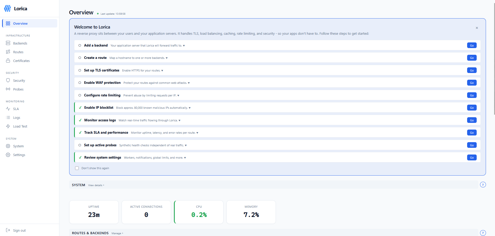
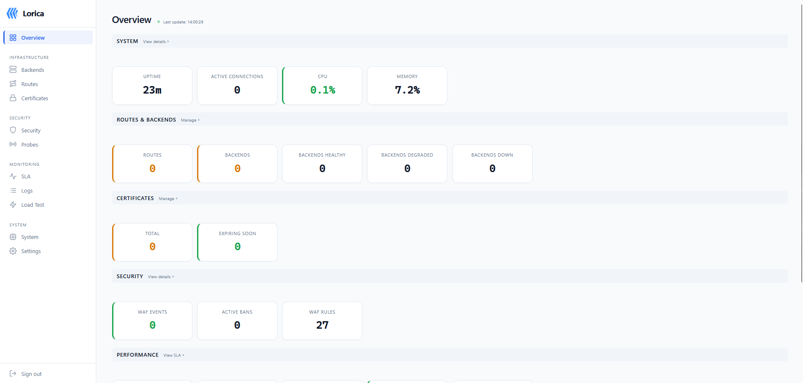
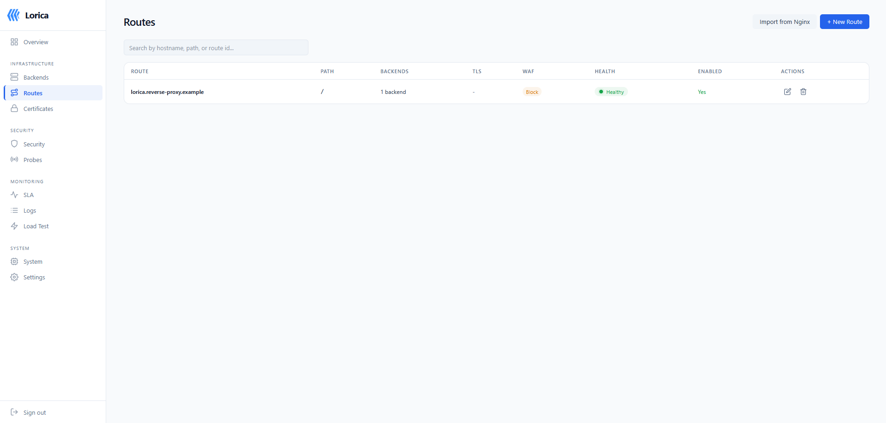
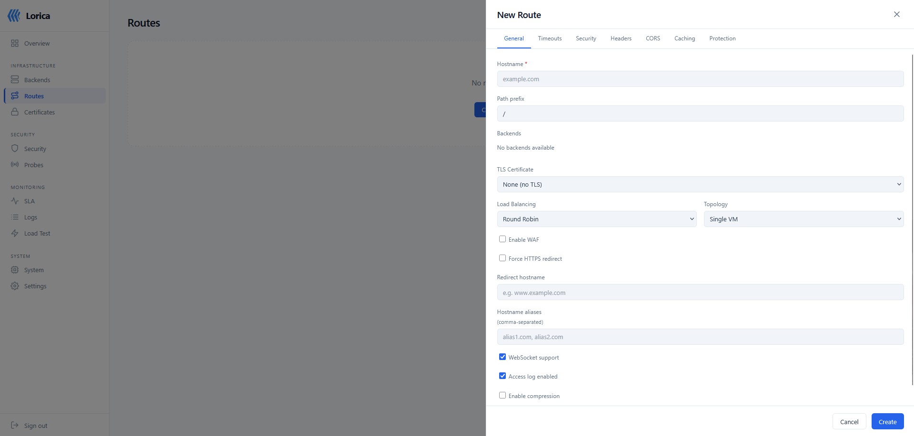
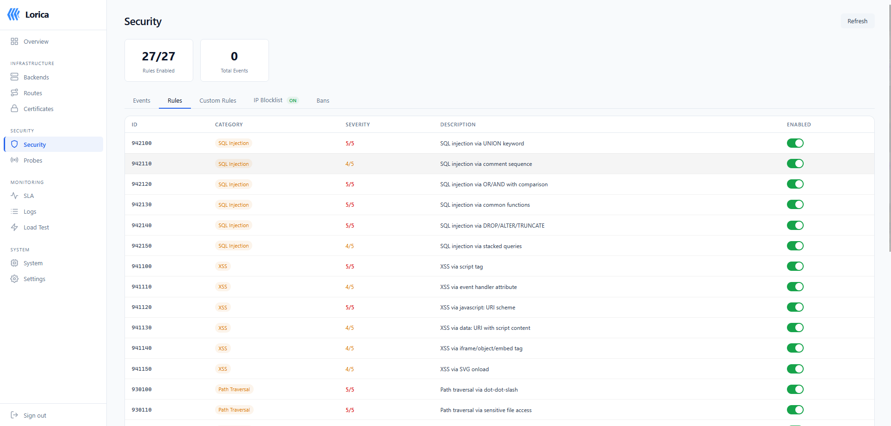
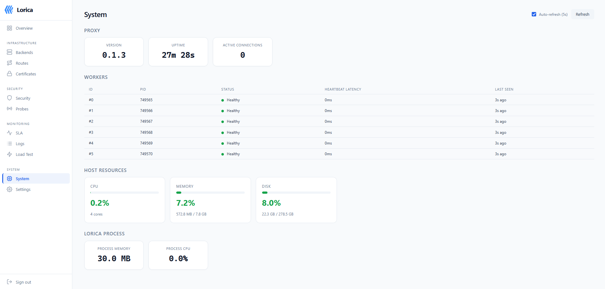

<p align="center">
  
  <h1 align="center">Lorica</h1>
  <p align="center"><strong>A modern, secure, dashboard-first reverse proxy built in Rust</strong></p>
</p>

<p align="center">
  <a href="LICENSE"></a>
  
  
  
  
  
</p>

---

Lorica is a production-ready reverse proxy with a built-in web dashboard, WAF, SLA monitoring, and HTTP caching. One binary, zero external dependencies. Install it, open your browser, and manage everything from the UI - routes, backends, certificates, security rules, and performance metrics. Since 1.7.0 the same binary runs as a fleet: one control plane pushes configuration and certificates to any number of followers over mutual TLS, and their logs, WAF events and audit trails fan back in.

Built on [Cloudflare Pingora](https://github.com/cloudflare/pingora), the engine that powers a significant portion of Cloudflare's CDN traffic.

## Key Features

### :shield: Proxy & Routing

- HTTP/HTTPS reverse proxy with host-based and path-prefix routing
- **Path rules** - ordered sub-path overrides within a route for backends, cache, headers, rate limits, or direct HTTP status responses
- **Header-based routing** - per-route rules that pick a backend group by request header value (Exact / Prefix / Regex). A/B testing (`X-Version: beta`), multi-tenant isolation (`X-Tenant: acme`), no upstream URL changes
- **Canary traffic split** - send `X%` of requests to an alternate backend group with sticky-per-IP deterministic bucketing. Multiple splits per route; weights capped at 100 cumulative
- **Response body rewriting** - ordered search-and-replace rules (literal or regex with capture groups) applied to upstream response bodies. Configurable content-type filter, max body cap, streams verbatim over the cap
- TLS termination via rustls (no OpenSSL dependency)
- SNI-based certificate selection with wildcard domain support (`*.example.com`)
- Path rewriting (strip/add prefix, regex with capture groups), hostname aliases, HTTP-to-HTTPS redirect
- Catch-all hostname (`_`) as last-resort fallback, `redirect_to` for domain redirects, `return_status` for direct responses
- **gRPC-Web bridge** - transparently converts HTTP/1.1 gRPC-web requests to HTTP/2 gRPC for upstream backends
- **Maintenance mode** - per-route 503 with Retry-After header and custom HTML error page
- **Custom error pages** - configurable HTML for upstream errors (502/504) with `{{status}}` and `{{message}}` placeholders
- Configurable proxy headers, per-route timeouts, WebSocket passthrough, X-Forwarded-Proto via TLS session detection
- Connection pooling with health-aware backend filtering

### :lock: Security

- **WAF engine** - 49 OWASP CRS-inspired rules (SQLi, XSS, path traversal, command injection, SSRF, Log4Shell, XXE, CRLF)
- **AI / LLM crawler deny-list** (v1.6.0) - curated registry of AI crawler User-Agents with per-vendor verification (forward-confirmed rDNS, published IP ranges, or UA-only), per-route policy (off / deny / log), auto-served `/robots.txt` advertising the active deny-list, spoofed-UA fallback policy, custom crawler rules, `lorica_ai_bot_total` counter. See `docs/ai-crawlers.md`
- **Tamper-evident audit log** (v1.6.0) - every state-mutating management call records operator, role, action, target, source IP, user agent and before/after payload hashes in a SHA-256 hash chain; `GET /api/v1/audit/verify` walks the chain and localises tampering to the earliest broken row; day-based retention is chain-safe. In a fleet (v1.7.0) every follower's trail fans in to the control plane as its own chain, verified separately
- **Management plane over TLS** (v1.6.0) - the loopback dashboard/API is served over HTTPS with a self-signed certificate generated on first boot (or an operator-supplied one), so the session cookie is `Secure`; `/metrics` requires a session or the bearer token in `prometheus_scrape_token` by default since v1.7.0
- **Secrets never on argv** (v1.7.0) - every management CLI command (`unban`, `upgrade`, `cluster token|leave|status|break-glass`) reads its password from `--password-file`, `--password-stdin` or `LORICA_ADMIN_PASSWORD`, and a join token only from a file, stdin or `LORICA_JOIN_TOKEN`
- **mTLS client verification** - per-route CA bundle + optional organization allowlist. Chain validated at the TLS handshake (rustls `WebPkiClientVerifier`), per-route enforcement returns 496 ("cert required") or 495 ("cert error"). `required` and org-allowlist hot-reload; CA edits take effect on restart
- **Forward authentication** - per-route sub-request to Authelia / Authentik / Keycloak / oauth2-proxy before proxying; 2xx injects response headers into upstream, 401/403/3xx forwarded verbatim to the client, timeout = fail-closed 503. Optional opt-in verdict cache (TTL-capped at 60s, Cookie-keyed) to shortcut hot paths. Under `--workers N` the cache is owned by the supervisor and routed through the pipelined RPC channel, so an Allow verdict cached by one worker is served from every worker, and a session revocation invalidates the cache uniformly (WPAR-2, design § 7)
- **Connection pre-filter** - global IP allow/deny CIDR policy enforced at TCP accept, before the TLS handshake. Deny always wins; non-empty allow switches to default-deny. Hot-reloaded via arc-swap in single-process and worker modes
- **IP blocklist** - auto-fetched from Data-Shield IPv4 Blocklist (~80,000 entries, O(1) lookup, updated every 6h)
- **Rate limiting** - per-route, per-client-IP with configurable RPS and burst tolerance (legacy event-rate estimator `rate_limit_rps` / `rate_limit_burst`)
- **Per-route token-bucket limiter** - exact-semantic admission control via `rate_limit: { capacity, refill_per_sec, scope }`. Runs ahead of mTLS / forward-auth / WAF so abusive clients are rejected cheaply with `429 Too Many Requests` + `Retry-After`. `scope: per_ip` isolates individual clients; `scope: per_route` caps aggregate traffic to a fragile origin. Cross-worker under `--workers N`: each worker's CAS-based `LocalBucket` cache syncs every 100 ms with the supervisor's authoritative state over a dedicated pipelined RPC channel. Aggregate bound: `capacity + 100 ms × N_workers × refill_per_sec` (documented in `docs/architecture/worker-shared-state.md` § 6)
- **Auto-ban** - IPs that repeatedly exceed rate limits (or trip the WAF) are banned automatically (configurable threshold and duration). Under `--workers N`, the WAF auto-ban counter lives in an anonymous `memfd` shared by all workers (no UDS round-trip per block), and the supervisor is the sole ban issuer, broadcasting `BanIp` on threshold crossing
- **Trusted proxies** - CIDR list for X-Forwarded-For validation, prevents IP spoofing via header injection
- **DDoS protection** - per-route max connections, global flood rate tracking
- **Slowloris detection** - rejects slow-header attacks with configurable threshold
- **Security headers** - presets (strict/moderate/none) with HSTS, CSP, X-Frame-Options, X-Content-Type-Options
- **HTTP Basic Auth** - per-route username/password authentication (Argon2id-hashed) with cached verification
- **IP allowlist/denylist** and **CORS configuration** per route
- **Certificate export** (v1.5.0, disabled by default) - mirror issued certificates as PEM files under `/var/lib/lorica/exported-certs/<hostname>/{cert,chain,fullchain,privkey}.pem` every time a cert is issued or renewed. Lets Ansible / HAProxy sidecar / backup jobs read the live bundle straight off disk without hitting the HTTP API. Atomic writes (`.tmp` stage + `fsync` + `rename`, cross-mount `EXDEV` fallback), per-file `chmod` + `chown` with configurable owner UID / group GID / octal modes (defaults 0o640 files / 0o750 dirs), fail-soft (export error never blocks the ACME renewal). Per-pattern ACL table narrows which hostnames are exported and with which UID / GID (exact match, leading `*.` wildcard, or bare `*`). Audit-logged + rate-limited `GET /api/v1/certificates/{id}/download` complements on-disk export for one-off downloads. Threat model: `docs/security/cert-export-threat-model.md`

### :bar_chart: Monitoring & Observability

- **Passive SLA** - per-route uptime, latency percentiles (p50/p95/p99), rolling windows (1h/24h/7d/30d)
- **Active SLA** - synthetic HTTP probes at configurable intervals, detects outages during low-traffic periods
- **Prometheus metrics** - `/metrics` endpoint with request counts, latency histograms, backend health, WAF events, cert expiry. Per-feature counters for cache-predictor bypass, header-rule matches, canary split selection, mirror outcomes (spawned / dropped / errored), forward-auth verdict cache hit rate - all bounded by route count. Under `--workers N` every scrape triggers a pull-on-scrape fan-out over the pipelined RPC channel so per-worker counters are sub-second fresh; concurrent scrapes dedup into a single fan-out and stuck workers fall back to cached state within a 500 ms per-worker timeout (WPAR-7)
- **Request mirroring (shadow testing)** - duplicate every request to one or more secondary backends (deterministic per `X-Request-Id` sampling, 256-slot concurrency cap, body mirroring up to a configurable cap). Fire-and-forget: mirror failure can never impact the primary
- **Real-time access logs** - WebSocket streaming to the dashboard with filtering
- **Load testing** - built-in load test engine with SSE streaming, cron scheduling, CPU circuit breaker, and result comparison
- **SLA breach alerts** - automatic notifications when SLA drops below target
- **Syslog export** (v1.7.0) - ship access logs, WAF events and audit entries to an existing SIEM as RFC 5424 messages over UDP, TCP (RFC 6587 octet-counting framing) or TCP+TLS (optional mutual TLS towards the collector). Configurable facility, per-event-kind severity mapping, per-kind toggles, and static structured-data parameters (`env=prod,dc=eu-west`). Fire-and-forget with a bounded queue: an unreachable collector sheds export rows (`lorica_log_sink_dropped_total`) and never affects request serving
- **OTLP logs export** (v1.7.0, needs a build with `--features otel`) - the same three event kinds as OTLP log records to the OpenTelemetry collector already configured for tracing, with `trace_id` / `span_id` attached from the request's span context so a log record joins its trace in Grafana / Tempo / Loki-style backends. Optional `Authorization` header for authenticated collectors (HTTP transports)

  <details>
  <summary>Worked examples: SIEM (syslog) and OTLP collector</summary>

  Syslog towards an rsyslog / SIEM ingest listening in TCP on 6514 with TLS:
  set **Settings → Log export** to endpoint `siem.example.com:6514`, transport
  `tcp-tls`, facility 16 (`local0`), keep the default severities
  (access=info, waf=warning, audit=notice), paste the collector CA if it is
  private. Matching rsyslog receiver:

  ```conf
  module(load="imtcp" StreamDriver.Name="gtls" StreamDriver.Mode="1")
  input(type="imtcp" port="6514")
  template(name="lorica" type="string" string="/var/log/lorica/%APP-NAME%-%$YEAR%%$MONTH%%$DAY%.log")
  if $app-name == "lorica" then action(type="omfile" dynaFile="lorica")
  ```

  OTLP logs towards an OpenTelemetry collector: enable **OTLP logs** in the
  same tab (the collector endpoint and protocol come from the Observability
  tab). Minimal collector pipeline:

  ```yaml
  receivers:
    otlp:
      protocols:
        http:
  exporters:
    file:
      path: /var/log/otel/lorica-logs.json
  service:
    pipelines:
      logs:
        receivers: [otlp]
        exporters: [file]
  ```

  Both sinks hot-reload on save (no restart) and each has a per-sink test
  button reporting success, failure reason and round-trip time.

  Capacity note: sinks are per-process by design (mode-independent, no
  cross-process queue). Under `--workers auto` an N-core node holds N
  worker connections plus one supervisor connection to the same
  collector, each with its own bounded queue - size collector
  connection limits for `cores`, not `1`, per node. Ordering across
  processes is the collector's concern.
  </details>

### :globe_with_meridians: Management

- **Multi-node cluster** (v1.7.0) - one control plane, any number of followers over mutual TLS with a fleet CA; short-lived join tokens bound to a node name, explicit activation, two-phase configuration replication with per-node route targeting, fleet-wide certificate issuance with need-to-know key distribution, and access logs / WAF events / bans / audit trail aggregated per node with one verifiable hash chain each. Followers are read-only with an audited break-glass window. See `docs/cluster.md`
- **Multi-user RBAC** (v1.6.0) - team accounts with three roles: `super_admin` (users, settings, config import, upgrades, fleet mutations), `operator` (full CRUD on routes, backends, certificates, WAF, SLA, probes, load tests, cache, bans; fleet reads) and `viewer` (read-only, secrets masked, fleet views hidden). Any role change, disable or password reset ends the target's sessions at once
- **Web dashboard** - Svelte 5 UI (~59 KB) embedded in the binary: routes, backends, certs, WAF, SLA, load tests, cluster, team, settings
- **REST API** - full CRUD for all entities, session-based auth, rate-limited login, a single fail-closed authorization middleware, OpenAPI description in `lorica-api/openapi.yaml`
- **TOML config export/import** - with diff preview before applying changes
- **Nginx config import** - paste an `nginx.conf` to auto-create routes, backends, certificates, and path rules with cert import support
- **ACME / Let's Encrypt** - automatic TLS provisioning via HTTP-01 and DNS-01 challenges (Cloudflare, Route53, OVH providers), multi-domain SAN and wildcard support, smart auto-renewal, OCSP stapling
- **DNS providers** - global DNS credentials configured once in Settings and referenced by ID for certificate provisioning (Cloudflare, Route53, OVH)
- **Notification channels** - stdout, SMTP email, HTTP webhook, Slack with per-channel rate limiting
- **Ban list management** - view and unban auto-banned IPs from the dashboard

### :zap: Performance

- **Pingora engine** - forked from Cloudflare's production proxy framework
- **HTTP cache** - in-memory response caching with LRU eviction (128 MiB cap), TinyUFO algorithm, cache lock (thundering herd protection), stale-while-revalidate **with background refresh** (serves stale immediately, fetches fresh in parallel) and stale-if-error, HTTP PURGE method support
- **Cache Vary** - per-route `cache_vary_headers` partitions the cache by request-header values (e.g. `Accept-Encoding`) merged with the origin's `Vary` response; `Vary: *` anchors on URI to bound cardinality
- **Cache predictor** - 16-shard LRU (32K keys) remembers deterministically-uncacheable responses and short-circuits the cache state machine on subsequent hits, avoiding cache-lock contention on known-bypass traffic
- **Peak EWMA load balancing** - latency-aware backend selection alongside Round Robin, Consistent Hash, Random, Least Connections
- **DashMap** - lock-free concurrent reads for ban list and route connections in the hot path
- **Sub-0.5ms WAF evaluation** - precompiled regex patterns with zero overhead when disabled

### :package: Reliability

- **Worker process isolation** - fork+exec with socket passing via SCM_RIGHTS
- **Protobuf command channel** - supervisor-to-worker config reload without traffic interruption. Under `--workers N`, reloads run as two-phase Prepare + Commit on a pipelined RPC channel so the divergence window between workers collapses to the UDS RTT (microseconds) instead of the per-worker DB-rebuild time (WPAR-8, design § 7). The same RPC plane carries cross-worker circuit-breaker admission (`BreakerDecision::AllowProbe` for HalfOpen) so probe slots are allocated atomically across workers and a failure on one trips the breaker for every worker (WPAR-3)
- **Health checks** - TCP and HTTP probes, backends marked degraded (>2s) or down and removed from rotation
- **Graceful drain** - per-backend active connection tracking with Closing/Closed lifecycle states
- **Certificate hot-swap** - atomic swap via arc-swap, zero downtime during rotation
- **Hot binary upgrade** (v1.6.0) - `POST /api/v1/system/upgrade`, `lorica upgrade --binary <path>` or the Settings "Binary upgrade" panel replaces the running binary with no dropped connections and no systemd restart: the new binary and its detached Ed25519 signature are verified against an operator-configured public key, the live listening sockets are handed over on a Unix socket, both supervisors accept during the overlap, and a new binary that fails within 10 s is quarantined while the old one resumes. Opt-in until a signing key is configured. See `docs/hot-upgrade.md`
- **Encrypted storage** - AES-256-GCM encryption for certificate private keys at rest

## Quick Start

### Install from .deb package

```bash
# Download the latest release
wget https://github.com/Rwx-G/Lorica/releases/latest/download/lorica.deb
sudo dpkg -i lorica.deb
```

The package creates a `lorica` user, installs a systemd service (enabled by default), and starts Lorica on ports 8080 (HTTP), 8443 (HTTPS), and 9443 (dashboard).

To customize ports, workers, or log level, edit the systemd unit:

```bash
sudo systemctl edit lorica
```

```ini
[Service]
ExecStart=
ExecStart=/usr/bin/lorica --data-dir /var/lib/lorica \
  --http-port 80 --https-port 443 --management-port 9443 \
  --workers 4 --log-level info
```

```bash
sudo systemctl restart lorica
```

### Run with Docker

Lorica is Linux-only, and its management API (dashboard) binds to `127.0.0.1`
**inside** the container. Publishing the port with `-p 9443:9443` therefore
does **not** expose the dashboard to the host. The simplest fix on Linux is to
share the host network with the container:

```bash
docker build -t lorica .
docker run -d --name lorica --network host \
  -v lorica-data:/var/lib/lorica lorica
```

With `--network host` the dashboard is reachable at `https://127.0.0.1:9443`
(TLS with a self-signed certificate generated on first boot - accept the
browser warning) and the proxy listeners bind straight onto the host -
`:8080` (HTTP) and `:8443` (HTTPS) - so no `-p` flags are needed.

Get the first-run admin password (printed to stdout once and persisted to a
0600 file inside the container):

```bash
docker exec lorica cat /var/lib/lorica/initial-admin-password
# Fallback only if the file write failed (password printed to stdout instead):
docker logs lorica 2>&1 | grep 'Initial admin password:'
```

Open `https://127.0.0.1:9443` in your browser (accept the self-signed
certificate) and log in with `admin` + the password. You will be prompted
to change it on first login.

> **Why not `-p 9443:9443`?** The management server binds `127.0.0.1` only
> (see `lorica-api/src/server.rs`), so port publishing cannot reach it. Use
> `--network host` for local dev. For a remote server where host networking
> is not an option, expose the dashboard via an SSH tunnel or Lorica's own
> self-proxy - see [docs/self-proxy-dashboard.md](docs/self-proxy-dashboard.md).

#### Why the management API is loopback-only

The dashboard and REST API bind to **`127.0.0.1` by design**, not by accident.
That keeps the management plane off the network so it cannot be exposed to the
web, even through misconfiguration. Binding to `0.0.0.0` is explicitly out of
scope - it would weaken this security boundary.

On a production host, reach the dashboard through an **SSH tunnel**:

```bash
ssh -L 9443:127.0.0.1:9443 user@host
```

Then open `https://127.0.0.1:9443` locally (accept the self-signed
certificate). For exposing the dashboard through the proxy itself (not
recommended for production), see
[docs/self-proxy-dashboard.md](docs/self-proxy-dashboard.md).

### Run directly

```bash
lorica --data-dir /var/lib/lorica
```

Open `https://127.0.0.1:9443` in your browser (loopback-only by design,
self-signed certificate - use an SSH tunnel on remote hosts; see above). On
first run, a random admin password is written to
`<data-dir>/initial-admin-password` (mode 0600).

### CLI options

```
lorica [OPTIONS] [COMMAND]

Options:
  --data-dir <PATH>                 Data directory (default: /var/lib/lorica)
  --management-port <PORT>          Dashboard/API port, loopback only (default: 9443)
  --http-port <PORT>                HTTP proxy port (default: 8080)
  --https-port <PORT>               HTTPS proxy port (default: 8443)
  --workers <N|auto>                Worker processes (default: 0 = single-process)
  --upstream-crl-file <PATH>        CRL checked against upstream server certificates
  --log-level <LEVEL>               Log level (default: info)
  --log-format <FORMAT>             Log format: json (default) or text
  --log-file <PATH>                 Log to file (in addition to stdout)
  --cluster-listen <HOST:PORT>      Serve the cluster plane (makes this node a control plane)
  --cluster-enrollment-listen <H:P> Enrollment listener bind (default: next port on the same host)
  --cluster-advertise <HOST>        Name followers dial, the SAN of the control-plane certificate
  --cluster-listen-any              Allow a wildcard host on the two listeners (never by accident)
  --cluster-auto-activate           Enrolled nodes become Active without operator approval (off)
  --version                         Print version

Commands:
  rotate-key                        Re-encrypt every stored secret under a new master key
  unban <IP>                        Lift a ban through the local management API
  upgrade --binary <PATH>           Hot binary upgrade (signature-verified, zero downtime)
  cluster init                      Generate the fleet CA on this control plane
  cluster token --node-name <NAME>  Mint a join token (SuperAdmin), printed once
  cluster join --control-plane <H:P> --token-file <PATH>
                                    Redeem a token and persist this node's fleet identity
  cluster status                    This node's fleet role and, with credentials, the live roster
  cluster break-glass [--close]     Re-enable local edits on a follower for a bounded window
  cluster leave                     Wipe this node's fleet identity (SuperAdmin, or proof of revocation)
```

Every command that needs the admin password reads it from `--password-file`
(mode 0600), `--password-stdin` or `LORICA_ADMIN_PASSWORD`; `--password` on
argv only prints a warning. `cluster join` accepts a token only from a file,
stdin or `LORICA_JOIN_TOKEN`. The global `--data-dir` goes before the
subcommand.

## Dashboard

The dashboard ships inside the binary and is served on the management port (default 9443). No separate frontend server, no npm, no build step - just open your browser.

<p align="center">
  
  <br><em>Getting started guide with interactive setup checklist</em>
</p>

<p align="center">
  
  <br><em>Overview cockpit with system health, routes, security, and performance at a glance</em>
</p>

<p align="center">
  
  <br><em>Routes table with hostname, backends, WAF mode, health status, and TLS</em>
</p>

<p align="center">
  
  <br><em>Route editor with 50+ settings across 7 tabs (General, Routing, Transform, Protection, Security, Cache, Upstream)</em>
</p>

<p align="center">
  
  <br><em>49 WAF rules with per-rule toggle, covering SQLi, XSS, SSRF, Log4Shell, XXE, and more</em>
</p>

<p align="center">
  
  <br><em>System page with worker health, heartbeat latency, CPU/memory gauges, and process metrics</em>
</p>

### Pages

- **Overview** - cockpit dashboard with section helpers, setup checklist, system/route/security/performance cards
- **Routes** - create/edit routes with host matching, path prefixes, load balancing, WAF mode, rate limits, caching, timeouts, security headers, CORS, and 25 other per-route settings
- **Backends** - manage backend addresses, weights, health check type (TCP/HTTP), TLS upstream, active connections
- **Certificates** - upload PEM certificates, view expiry dates, provision via ACME/Let's Encrypt (HTTP-01, DNS-01)
- **Security** - WAF event table with category filtering, 49 rule toggles, IP ban list with unban button, admin audit log with chain verification; on a control plane every tab carries a node filter over the fleet's events, bans and audit chains
- **SLA** - per-route passive/active SLA side-by-side, latency percentile tables, config editor, CSV/JSON export; on a control plane a node picker shows one follower's own figures (never a fleet aggregate: a fleet percentile is not a function of per-node percentiles)
- **Load Tests** - test config management with clone, one-click execution, real-time SSE progress panel, historical results
- **Active Probes** - CRUD for synthetic health probes with route selection, HTTP method/path/status/interval/timeout
- **Access Logs** - scrollable real-time log stream via WebSocket with green pulsing indicator; on a control plane, the fleet's access logs with a node column and filter
- **Cluster** (v1.7.0) - the fleet roster with live sessions, applied configuration generation, resource gauges, per-node certificate entitlement and recent WAF events, join-token dialog with the ready-to-paste `cluster join` command, activation and revocation (which names the keys to re-issue); on a follower, the read-only banner with break-glass and leave
- **System** - worker table with PID, health, heartbeat latency; CPU/memory/disk gauges
- **Settings** - notification channels, security header presets, DNS providers (Cloudflare / Route53 / OVH), ban rules, OpenTelemetry exporter, log export (syslog and OTLP logs, per-sink test), GeoIP / ASN databases, AI crawler policy, team (users and roles), binary upgrade, certificate filesystem export zone + ACL editor, config export / import with diff preview
- **Theme** - light/dark mode toggle

## Architecture

Lorica is a Rust workspace with 31 crates: 16 forked from Cloudflare Pingora and 15 product crates. See [FORK.md](FORK.md) for the full fork lineage and renaming rules.

| Crate | Purpose |
|-------|---------|
| `lorica` | CLI binary, supervisor, worker orchestration |
| `lorica-proxy` | HTTP/HTTPS proxy engine (Pingora fork) |
| `lorica-tls` | SNI certificate resolver, hot-swap, encrypted key storage |
| `lorica-acme` | Pure ACME core: HTTP-01 / DNS-01 issuance driver, DNS challengers (Cloudflare / Route53 / OVH) |
| `lorica-config` | SQLite store, versioned migrations, TOML export/import |
| `lorica-api` | axum REST API, auth, session management, RBAC |
| `lorica-dashboard` | Svelte 5 frontend embedded via rust-embed |
| `lorica-waf` | WAF engine, OWASP rules, IP blocklist |
| `lorica-notify` | Alert dispatch (stdout, SMTP, webhook, Slack) |
| `lorica-bench` | SLA monitoring, load testing engine |
| `lorica-metrics` | Shared Prometheus registry + cross-worker counter aggregation |
| `lorica-worker` | fork+exec worker isolation, typed FD passing (Listener / Shmem / Rpc) |
| `lorica-command` | Protobuf supervisor-worker command channel + pipelined RpcEndpoint (Envelope framing, in-flight demux, bounded backpressure), `Coalescer`, `GenerationGate` |
| `lorica-shmem` | Anonymous `memfd` region shared across all workers; `AtomicHashTable` for per-IP WAF flood / auto-ban counters; SipHash-1-3 anti-HashDoS; 5-min eviction walker |
| `lorica-cluster` | Cluster plane (v1.7.0): mutual-TLS transport on the same `RpcEndpoint` as the worker channel, fleet CA, join tokens, enrollment and operational listeners, roster and session registry, two-phase replication, telemetry ingest quota; configuration-blind by design (the blob is opaque bytes to it) |
| `lorica-geoip` | GeoIP / ASN lookups (MaxMind-format databases) for country and network policy |
| `lorica-challenge` | Bot challenges: proof-of-work, image captcha (vendored renderer), cookie issuance |
| `lorica-lb` | Load balancing (Round Robin, Peak EWMA, Hash, Random, Least Conn) |
| `lorica-cache` | HTTP response cache, LRU eviction |
| `lorica-limits` | Rate estimator + per-route `LocalBucket` / `AuthoritativeBucket` token-bucket primitives (lock-free CAS, 100 ms cross-worker sync) |

Data plane (proxy) and control plane (API/dashboard) are fully separated. API mutations trigger config reload via arc-swap - the proxy picks up changes without restarting.

## Performance

Measured on a single Linux VM (4 vCPU, 8 GB RAM):

| Metric | Value |
|--------|-------|
| Single-process throughput | ~6,500 req/s |
| Multi-worker throughput (4 workers) | ~25,000 req/s |
| WAF evaluation latency | < 0.5 ms per request |
| WAF overhead on throughput | ~6% |
| Dashboard bundle size | ~59 KB (gzipped) |
| Config reload | Zero-downtime (arc-swap) |
| Certificate hot-swap | Zero-downtime (atomic) |

## Configuration Example

Create a route via the REST API:

```bash
# Authenticate
TOKEN=$(curl -sk https://127.0.0.1:9443/api/v1/auth/login \
  -H 'Content-Type: application/json' \
  -d '{"username":"admin","password":"your-admin-password"}' \
  -c - | grep lorica_session | awk '{print $NF}')

# Create a backend
curl -sk https://127.0.0.1:9443/api/v1/backends \
  -b "lorica_session=$TOKEN" \
  -H 'Content-Type: application/json' \
  -d '{
    "address": "127.0.0.1:8080",
    "health_check_interval_s": 10,
    "health_check_type": "http",
    "health_check_path": "/healthz"
  }'

# Create a route (ids are server-assigned UUIDs returned by the creates above)
curl -sk https://127.0.0.1:9443/api/v1/routes \
  -b "lorica_session=$TOKEN" \
  -H 'Content-Type: application/json' \
  -d '{
    "hostname": "app.example.com",
    "path_prefix": "/",
    "backend_ids": ["<backend-uuid>"],
    "load_balancing": "peak_ewma",
    "tls_enabled": true,
    "certificate_id": "<certificate-uuid>",
    "waf_enabled": true,
    "waf_mode": "block",
    "rate_limit_rps": 100,
    "rate_limit_burst": 50,
    "cache_enabled": true,
    "cache_ttl_s": 300,
    "force_https": true,
    "security_headers": "strict"
  }'
```

Or just use the dashboard - it covers all the same operations with zero curl.

## REST API Reference

All endpoints are served on the management port (default `9443`) over HTTPS (a self-signed certificate generated on first boot; loopback only, so `curl -k` accepts it). Protected endpoints require a session cookie obtained via `/api/v1/auth/login`.

### Public endpoints

| Method | Path | Description |
|--------|------|-------------|
| `POST` | `/api/v1/auth/login` | Authenticate (returns session cookie) |
| `POST` | `/api/v1/auth/logout` | Invalidate session |
| `GET` | `/metrics` | Prometheus metrics. Authenticated by default since 1.7.0: the bearer token in `prometheus_scrape_token` (or `LORICA_PROMETHEUS_SCRAPE_TOKEN`), or a session cookie sent as a header (it is scoped to `/api`, so a browser does not send it here); `metrics_require_auth = false` restores the open endpoint |
| `GET` | `/.well-known/acme-challenge/{token}` | ACME HTTP-01 challenge response |

### Auth & Users (RBAC)

| Method | Path | Description |
|--------|------|-------------|
| `GET` | `/api/v1/auth/me` | Current session user and role |
| `PUT` | `/api/v1/auth/password` | Change own password |
| `GET` | `/api/v1/users` | List users |
| `POST` | `/api/v1/users` | Create user (role-scoped) |
| `PUT` | `/api/v1/users/{id}` | Update user (role, password reset) |
| `DELETE` | `/api/v1/users/{id}` | Delete user |

### Routes

| Method | Path | Description |
|--------|------|-------------|
| `GET` | `/api/v1/routes` | List all routes |
| `POST` | `/api/v1/routes` | Create route |
| `GET` | `/api/v1/routes/{id}` | Get route |
| `PUT` | `/api/v1/routes/{id}` | Update route |
| `DELETE` | `/api/v1/routes/{id}` | Delete route |
| `POST` | `/api/v1/validate/mtls-pem` | Parse a candidate client-CA PEM and return per-cert subjects |
| `POST` | `/api/v1/validate/forward-auth` | Probe a candidate forward-auth URL (one GET, status + elapsed) |

### Backends

| Method | Path | Description |
|--------|------|-------------|
| `GET` | `/api/v1/backends` | List all backends |
| `POST` | `/api/v1/backends` | Create backend |
| `GET` | `/api/v1/backends/{id}` | Get backend |
| `PUT` | `/api/v1/backends/{id}` | Update backend |
| `DELETE` | `/api/v1/backends/{id}` | Delete backend |

### Certificates

| Method | Path | Description |
|--------|------|-------------|
| `GET` | `/api/v1/certificates` | List certificates |
| `POST` | `/api/v1/certificates` | Upload PEM certificate |
| `POST` | `/api/v1/certificates/self-signed` | Generate self-signed certificate |
| `GET` | `/api/v1/certificates/{id}` | Get certificate |
| `GET` | `/api/v1/certificates/{id}/download?part={cert\|key\|chain\|bundle}` | Download PEM material (rate-limited, audit-logged) |
| `POST` | `/api/v1/certificates/{id}/renew` | Force ACME renewal of a certificate |
| `PUT` | `/api/v1/certificates/{id}` | Update certificate |
| `DELETE` | `/api/v1/certificates/{id}` | Delete certificate |
| `GET` | `/api/v1/cert-export/acls` | List per-pattern cert-export ACLs |
| `POST` | `/api/v1/cert-export/acls` | Create a cert-export ACL rule |
| `DELETE` | `/api/v1/cert-export/acls/{id}` | Delete a cert-export ACL rule |
| `POST` | `/api/v1/cert-export/reapply` | Re-export every certificate to disk |
| `GET` | `/api/v1/cert-export/orphans` | List per-hostname subdirectories with no matching live cert |
| `DELETE` | `/api/v1/cert-export/orphans/{name}` | Remove one orphan subdirectory (sanitised + live-cert guard) |

### ACME & DNS Providers

| Method | Path | Description |
|--------|------|-------------|
| `POST` | `/api/v1/acme/provision` | Provision via HTTP-01 |
| `POST` | `/api/v1/acme/provision-dns` | Provision via DNS-01 |
| `POST` | `/api/v1/acme/provision-dns-manual` | Start manual DNS-01 flow |
| `POST` | `/api/v1/acme/provision-dns-manual/check` | Poll DNS propagation for the manual flow |
| `POST` | `/api/v1/acme/provision-dns-manual/confirm` | Confirm manual DNS-01 |
| `GET` | `/api/v1/dns-providers` | List DNS provider credentials |
| `POST` | `/api/v1/dns-providers` | Create a DNS provider credential |
| `PUT` | `/api/v1/dns-providers/{id}` | Update a DNS provider credential |
| `DELETE` | `/api/v1/dns-providers/{id}` | Delete a DNS provider credential |
| `POST` | `/api/v1/dns-providers/{id}/test` | Test a DNS provider credential |

### AI Crawlers

| Method | Path | Description |
|--------|------|-------------|
| `GET` | `/api/v1/ai-crawlers/builtin` | List built-in known-bot signatures |
| `GET` | `/api/v1/ai-crawlers/custom` | List custom crawler rules |
| `POST` | `/api/v1/ai-crawlers/custom` | Create a custom crawler rule |
| `PUT` | `/api/v1/ai-crawlers/custom/{id}` | Update a custom crawler rule |
| `DELETE` | `/api/v1/ai-crawlers/custom/{id}` | Delete a custom crawler rule |
| `GET` | `/api/v1/ai-crawlers/robots-preview` | Preview the generated `robots.txt` |
| `GET` | `/api/v1/ai-crawlers/test` | Test a User-Agent against the matcher |
| `GET` | `/api/v1/ai-crawlers/stats` | AI-crawler match counters |

### WAF

| Method | Path | Description |
|--------|------|-------------|
| `GET` | `/api/v1/waf/events` | Recent WAF events (with category filter) |
| `DELETE` | `/api/v1/waf/events` | Clear WAF events |
| `GET` | `/api/v1/waf/stats` | WAF statistics |
| `GET` | `/api/v1/waf/rules` | List WAF rules |
| `PUT` | `/api/v1/waf/rules/{id}` | Enable/disable rule |
| `GET` | `/api/v1/waf/rules/custom` | List custom rules |
| `POST` | `/api/v1/waf/rules/custom` | Create custom rule |
| `DELETE` | `/api/v1/waf/rules/custom/{id}` | Delete custom rule |
| `GET` | `/api/v1/waf/blocklist` | Blocklist status |
| `PUT` | `/api/v1/waf/blocklist` | Enable/disable blocklist |
| `POST` | `/api/v1/waf/blocklist/reload` | Reload blocklist |

### SLA & Probes

| Method | Path | Description |
|--------|------|-------------|
| `GET` | `/api/v1/sla/overview` | SLA overview for all routes (`?node=` on a control plane: one follower's own, Operator+) |
| `GET` | `/api/v1/sla/routes/{id}` | SLA metrics for route (`?node=` as above) |
| `GET` | `/api/v1/sla/routes/{id}/buckets` | Time-bucketed SLA data (`?node=` as above) |
| `GET` | `/api/v1/sla/routes/{id}/config` | SLA config |
| `PUT` | `/api/v1/sla/routes/{id}/config` | Update SLA config |
| `GET` | `/api/v1/sla/routes/{id}/export` | Export SLA data (CSV/JSON) |
| `GET` | `/api/v1/sla/routes/{id}/active` | Active probe results (`?node=` as above) |
| `DELETE` | `/api/v1/sla/routes/{id}/data` | Clear stored SLA data for a route |
| `GET` | `/api/v1/probes` | List probes |
| `POST` | `/api/v1/probes` | Create probe |
| `GET` | `/api/v1/probes/route/{route_id}` | Probes for route |
| `GET` | `/api/v1/probes/{id}/history` | Probe result history |
| `PUT` | `/api/v1/probes/{id}` | Update probe |
| `DELETE` | `/api/v1/probes/{id}` | Delete probe |

### Load Testing

| Method | Path | Description |
|--------|------|-------------|
| `GET` | `/api/v1/loadtest/configs` | List configs |
| `POST` | `/api/v1/loadtest/configs` | Create config |
| `PUT` | `/api/v1/loadtest/configs/{id}` | Update config |
| `DELETE` | `/api/v1/loadtest/configs/{id}` | Delete config |
| `POST` | `/api/v1/loadtest/configs/{id}/clone` | Clone config |
| `POST` | `/api/v1/loadtest/start/{config_id}` | Start test (requires confirm) |
| `POST` | `/api/v1/loadtest/start/{config_id}/confirm` | Confirm and execute |
| `GET` | `/api/v1/loadtest/status` | Current test status |
| `GET` | `/api/v1/loadtest/ws` | WebSocket real-time progress |
| `POST` | `/api/v1/loadtest/abort` | Abort running test |
| `GET` | `/api/v1/loadtest/results/{config_id}` | Test results |
| `GET` | `/api/v1/loadtest/results/{config_id}/compare` | Compare runs |

### Cache & Bans

| Method | Path | Description |
|--------|------|-------------|
| `DELETE` | `/api/v1/cache/routes/{id}` | Purge route cache |
| `GET` | `/api/v1/cache/stats` | Cache hit/miss stats |
| `GET` | `/api/v1/bans` | List banned IPs |
| `DELETE` | `/api/v1/bans/{ip}` | Unban IP |

### Audit Log

| Method | Path | Description |
|--------|------|-------------|
| `GET` | `/api/v1/audit` | List admin audit-log entries (Operator+; on a control plane the fleet's trail needs SuperAdmin unless `?node=` names this node's own chain) |
| `GET` | `/api/v1/audit/verify` | Verify the audit-log hash chains, one verdict per node (SuperAdmin) |

### Cluster (v1.7.0)

Fleet reads are Operator+, fleet mutations SuperAdmin; every one of them answers `409` on a node that is not a control plane. See `docs/cluster.md`.

| Method | Path | Description |
|--------|------|-------------|
| `GET` | `/api/v1/cluster/status` | This node's fleet role, connection state and, on a control plane, the roster summary (Viewer+) |
| `GET` | `/api/v1/cluster/nodes` | The roster with live session facts, resource gauges and certificate entitlement |
| `GET` | `/api/v1/cluster/nodes/{id}` | One enrolled node |
| `POST` | `/api/v1/cluster/nodes/{id}/activate` | Approve a pending node: it receives configuration and keys from then on |
| `DELETE` | `/api/v1/cluster/nodes/{id}` | Revoke a node (CRL, session ended at once); the answer names the certificates whose key it keeps, to re-issue |
| `GET` / `POST` | `/api/v1/cluster/tokens` | List / mint join tokens (bound to a node name, optionally a source CIDR, short-lived) |
| `DELETE` | `/api/v1/cluster/tokens/{public_id}` | Revoke an unused token |
| `GET` | `/api/v1/cluster/replication` | The last replication round's report per node |
| `GET` | `/api/v1/cluster/drift` | Nodes whose applied configuration differs from the current generation |
| `GET` | `/api/v1/cluster/logs` | The fleet's access logs, cursor-paginated, `?node=` / `?route=` filters |
| `GET` | `/api/v1/cluster/waf-events` | The fleet's WAF events, `?node=` / `?category=` filters |
| `GET` / `POST` | `/api/v1/cluster/bans` | Every node's live bans as last reported / issue a fleet-wide ban |
| `GET` / `POST` / `DELETE` | `/api/v1/cluster/break-glass` | On a follower: the window's state / open it for a bounded time / close it (SuperAdmin) |
| `POST` | `/api/v1/cluster/leave` | On a follower: tell the control plane, wipe the fleet identity (SuperAdmin) |

### System & Configuration

| Method | Path | Description |
|--------|------|-------------|
| `GET` | `/api/v1/settings` | Global settings |
| `PUT` | `/api/v1/settings` | Update settings (rejects cross-field-inconsistent values with 400) |
| `GET` | `/api/v1/settings/schema` | Settings field schema (bounds, defaults) |
| `POST` | `/api/v1/settings/otel/test` | Test the OpenTelemetry exporter connection |
| `POST` | `/api/v1/settings/syslog/test` | Send a test message over the syslog export sink |
| `POST` | `/api/v1/settings/otlp-logs/test` | Probe the OTLP collector's logs signal path |
| `GET` | `/api/v1/status` | System status summary |
| `GET` | `/api/v1/system` | CPU, memory, disk usage |
| `POST` | `/api/v1/system/upgrade` | Hot binary upgrade (signature-verified, zero-downtime) |
| `GET` | `/api/v1/metrics` | The `/metrics` document behind the dashboard session, for a browser (the session cookie is scoped to `/api`) |
| `GET` | `/api/v1/workers` | Worker heartbeat metrics |
| `GET` | `/api/v1/logs` | Access logs |
| `DELETE` | `/api/v1/logs` | Clear logs |
| `GET` | `/api/v1/logs/export` | Export access logs (CSV/JSON) |
| `GET` | `/api/v1/logs/ws` | WebSocket log stream |
| `POST` | `/api/v1/config/export` | Export config as TOML |
| `POST` | `/api/v1/config/import` | Import TOML config |
| `POST` | `/api/v1/config/import/preview` | Preview import diff |
| `GET` | `/api/v1/notifications` | List notification configs |
| `POST` | `/api/v1/notifications` | Create notification config |
| `PUT` | `/api/v1/notifications/{id}` | Update notification config |
| `DELETE` | `/api/v1/notifications/{id}` | Delete notification config |
| `POST` | `/api/v1/notifications/{id}/test` | Test notification channel |
| `GET` | `/api/v1/notifications/history` | Notification dispatch history |
| `GET` | `/api/v1/preferences` | List user preferences |
| `PUT` | `/api/v1/preferences/{id}` | Update preference |
| `DELETE` | `/api/v1/preferences/{id}` | Delete preference |

## Building from Source

```bash
# Prerequisites
# - Rust 1.88+
# - Node.js 20+ (Vite 8 minimum, dashboard compilation)
# - Linux (x86_64)

git clone https://github.com/Rwx-G/Lorica.git
cd Lorica
cargo build --release

# Binary is at target/release/lorica
# The Svelte frontend is compiled automatically during cargo build.
```

### Running tests

```bash
# Every Rust test in the workspace
cargo test --workspace

# Product crates only (2034 tests, Lorica-native)
cargo test -p lorica-config -p lorica-api -p lorica -p lorica-waf \
           -p lorica-notify -p lorica-bench -p lorica-worker \
           -p lorica-command -p lorica-limits -p lorica-shmem \
           -p lorica-challenge -p lorica-geoip -p lorica-acme \
           -p lorica-metrics -p lorica-cluster -p lorica-dashboard \
           --features otel

# Pingora-forked crates (658 tests)
cargo test -p lorica-core -p lorica-proxy -p lorica-http \
           -p lorica-error -p lorica-tls -p lorica-cache \
           -p lorica-pool -p lorica-runtime -p lorica-timeout \
           -p lorica-lb -p lorica-ketama -p lorica-lru \
           -p lorica-memory-cache -p lorica-header-serde -p tinyufo

# The cluster crate's integration binaries, including the frozen v1.7.0
# wire corpus (every message's encoding, pinned)
cargo test -p lorica-cluster --tests

# Frontend (423 Vitest cases across 15 files) and its gates
cd lorica-dashboard/frontend && npm run check && npm run lint && npx vitest run
```

The `lorica` binary crate carries 17 end-to-end binaries under
`lorica/tests/` that drive a real Pingora `Server` against mock backends
(mTLS, response rewriting, mirroring, forward auth, stale-while-revalidate,
the connection pre-filter, canary and header routing, config reload, rate
limits and their cross-worker sync, the circuit breaker and the RPC
plane). They run as part of `cargo test -p lorica`.

#### Docker end-to-end suites

`tests-e2e-docker/` spins Lorica up against real backend containers and
drives every profile through the actual network stack. `./run.sh --build`
runs them all in sequence; each `--skip-<profile>` flag drops one.

| Profile | Assertions | What it proves |
|---|---|---|
| base (single-process) | 348 | routing, TLS, WAF, rate limits, cache, SLA, load tests, ACME challenge path, `/metrics` gated by default |
| workers | 90 | the same under `--workers 2`: two-phase reload, cross-worker breaker, shmem auto-ban, metrics pull-on-scrape, forward-auth cache |
| cert-export | 39 | PEM disk export, ACL, reapply, orphans |
| ai-bot, ai-bot-workers | 52, 49 | AI crawler verdicts, robots.txt, verified-bot headers, in both modes |
| rbac, rbac-workers | 37, 37 | per-role 403 matrix, user CRUD, session invalidation |
| audit | 17 | the hash chain, tamper localisation, role floors |
| hot-upgrade | 29 | signature verification, socket handover, rollback of a failing binary |
| log-sinks | 23 | RFC 5424 syslog over TCP and OTLP logs, delivered to real collectors |
| acme | 15 | HTTP-01 and manual DNS-01 issuance against the Pebble fixture |
| cluster | 63 | a control plane and two followers (one in workers mode): enrollment, activation, replication, an HTTP-01 order validated through the selected follower, need-to-know key distribution, telemetry and audit fan-in, a load phase at 300 rps per follower, per-node SLA reads, break-glass, revocation |
| bot, bot-workers, geoip, rdns, otel, otel-workers | 29, 29, 16, 7, 16, 16 | bot challenges, country policy, rDNS bypass, OTLP traces; run individually with `docker compose --profile <name> run --rm <name>-smoke` |

The two intentional gaps in the Docker harness are:

- **mTLS client-cert handshake** (495 / 496 / 200 based on the
  presented cert). The e2e container starts without any TLS certs
  pre-loaded so the HTTPS listener on port 8443 is never built -
  driving `curl --cert` needs a staged environment. The config
  surface (CA PEM validation, `required` + `allowed_organizations`
  hot-reload) is covered.
- **Connection pre-filter TCP drop** (scanner IP refused at
  `accept()` before TLS). The test-runner sits on the same Docker
  network as Lorica, so any CIDR that would cover a real scanner
  also covers the runner - asserting the drop from inside would be
  self-blocking. The config round-trip (valid CIDR accepted, garbage
  rejected 400) is covered.

Validate both manually on staging when touching the surrounding
code paths.

## systemd Service

The `.deb` and `.rpm` packages install a hardened systemd unit with:

- `ProtectSystem=strict`, `PrivateTmp=yes`, `NoNewPrivileges=yes`
- `MemoryDenyWriteExecute=yes`, `SystemCallFilter=@system-service`
- `RestrictNamespaces=yes`, `RestrictSUIDSGID=yes`
- Runs as dedicated `lorica` user with `CAP_NET_BIND_SERVICE`
- Service auto-starts on install and auto-restarts on upgrade
- Data directory (`/var/lib/lorica`) preserved across upgrades

Customize the service (e.g. enable workers) via drop-in override:

```bash
sudo systemctl edit lorica
```

```ini
[Service]
ExecStart=
ExecStart=/usr/bin/lorica --workers 6
```

## Performance Tuning

See [docs/tuning.md](docs/tuning.md) for kernel parameters (`sysctl`), file descriptor limits, worker configuration, cache settings, and a production readiness checklist. Run [bench/](bench/) for reproducible throughput measurements.

## Worker Mode

When running with `--workers N >= 1`, see [docs/worker-mode.md](docs/worker-mode.md) for the operational notes (which settings require a supervisor restart, what changes between single-process and worker mode).

## Running a Fleet

One node is the control plane; every other node is a follower that receives
its configuration and certificates from it and fans its logs, WAF events,
bans and audit trail back in. Followers are read-only (a mutation answers
`409`) until a SuperAdmin opens a bounded, audited break-glass window.

```bash
# On the control plane: generate the fleet CA, then serve the cluster plane.
lorica --data-dir /var/lib/lorica cluster init
lorica --data-dir /var/lib/lorica --cluster-listen 10.0.0.10:9444 --cluster-advertise cp.internal.example.org

# Mint a token bound to the node name the route selectors will use.
lorica cluster token --node-name edge-01 --password-file /root/.lorica-admin

# On the new node: redeem it (the token never touches argv), then start.
lorica --data-dir /var/lib/lorica cluster join \
  --control-plane cp.internal.example.org:9444 --name edge-01 --token-file /root/join-token
lorica --data-dir /var/lib/lorica

# Back on the control plane: approve it. Nothing flows before activation.
curl -sk -b "lorica_session=$TOKEN" -X POST https://127.0.0.1:9443/api/v1/cluster/nodes/<node-id>/activate
```

What every node keeps as its own: listening addresses, data directory, log
sinks' endpoints, export zone and master key. Everything else replicates.
Upgrade followers before the control plane (a follower whose schema is behind
is refused at the handshake). `docs/cluster.md` covers the trust model (the
control plane's `encryption.key` is the fleet's identity root), replication,
key distribution, telemetry fan-in and its measured envelope, the audit
trail, failure modes and how to replace a control plane.

## Documentation

- [docs/installation.md](docs/installation.md) - packages, first boot, the management plane's TLS certificate
- [docs/cluster.md](docs/cluster.md) - multi-node operation, end to end
- [docs/security.md](docs/security.md), [docs/security/hardening-guide.md](docs/security/hardening-guide.md), [docs/security/threat-model.md](docs/security/threat-model.md) - what is protected, how, and what is not
- [docs/worker-mode.md](docs/worker-mode.md), [docs/tuning.md](docs/tuning.md) - `--workers`, kernel and file-descriptor tuning
- [docs/hot-upgrade.md](docs/hot-upgrade.md), [docs/ai-crawlers.md](docs/ai-crawlers.md), [docs/self-proxy-dashboard.md](docs/self-proxy-dashboard.md)
- [CHANGELOG.md](CHANGELOG.md), [COMPARISON.md](COMPARISON.md), [FORK.md](FORK.md)

## Package Verification

Release `.deb` and `.rpm` packages are GPG-signed. Import the public key to verify:

```bash
curl -fsSL https://github.com/Rwx-G/Lorica/raw/main/docs/lorica-signing-key.asc | sudo gpg --dearmor -o /usr/share/keyrings/lorica.gpg
gpg --verify lorica.deb.asc lorica.deb
```

## Roadmap

| Version | Features | Status |
|---------|----------|--------|
| v1.4.0 | OpenTelemetry tracing (OTLP), GeoIP country blocking, Bot protection (PoW / captcha / cookie with 5-category bypass matrix) | Shipped |
| v1.5.0 | Operator-input guard-rails on every field with blur + input inline errors; Route `group_name` + filter + colored pill; Certificate download API + dashboard split-menu with private-key confirm; Filesystem certificate export zone with per-pattern ACL, Settings tab, operator re-export endpoint, orphan sweep + per-row delete; Path-rule redirect fix ; Security hardening wave: `ammonia` HTML sanitiser, per-endpoint rate limits on management plane, per-route body-size limits with 1 MiB global default, session cookie rotation on password change, `/system` response filter, `rustls-pemfile → rustls-pki-types` migration, `rand 0.9` bump, source-error preservation on `.map_err` chains, WebSocket log-stream backpressure with close-on-slow-client ; Doc coverage pass + `#![warn(missing_docs)]` on every Lorica-native crate ; ACME unit tests (`wiremock` on Cloudflare + OVH challengers, `is_valid_dns_server` shell-filter, pure `should_auto_renew` predicate) ; `verdict_cache` test-parallelism race fixed via `serial_test` | Shipped |
| **v1.5.1 + v1.5.2 (audit-closure cycles)** | Worker-mode cert hot-reload (cert install / renew now serves new cert across all workers without restart) ; SMTP encryption modes (`starttls` / `tls` / `none`) for the Email notification channel ; security defense-in-depth pass : webhook URL + Slack URL + auth_header scrubbed on JSON GET (matched the v1.5.1 TOML scrub asymmetry), CSV formula injection guard on access-log export, CSP3 directives (`frame-ancestors`, `form-action`, `base-uri`, `object-src`), per-endpoint rate limits broadened to ~16 mutating endpoints, redirect-policy=none on webhook / OCSP / blocklist clients ; reactor-stall pass : `LogStore` + `enforce_notification_retention` off-loaded to `spawn_blocking` ; reload pass : two-phase + legacy converged through one `apply_per_process_resolver_hooks` helper, cert-resolver reload serialised, OTel / GeoIP / ASN apply-error counter ; perf : Cow URL decode + `itoa` status formatting + chrono deferred until WAF match + `dashmap` fast-path on bot stash + `parking_lot::Mutex` on hot path + `RuleSet::matches` prefilter shortcut ; deps : `rustls-webpki 0.103.13` (RUSTSEC-2026-0104 + 0099), `postcss 8.5.10` (CVE-2026-41305), `aws-lc-rs` dropped from the `lorica-tls` crypto stack in favor of `ring` (the broader binary still pulls `aws-lc-rs` transitively via the rustls 0.23 default stack in `lorica-api`), `x509-parser 0.18` aligned across `lorica-tls` / `lorica-api` ; chore : `~50` magic-number `bl()` / `rl()` calls in `server.rs` lifted to `pub const`, 3 `formatBytes` dashboard implementations consolidated into `lib/format.ts`, 3 `docs/security.md` drift items fixed (49 WAF rules + ~80k IP blocklist) | Shipped |
| v1.6.0 | AI-crawler (LLM) deny-list as a first-class feature (known-bot User-Agent + rDNS matcher, per-route opt-in / opt-out, Prometheus counter), Hot binary upgrade (zero-downtime restart), Team settings (multiple users, roles, RBAC), TLS management plane, cert-resolver reliability + background OCSP, rate-limit unification, vendored captcha | Shipped |
| v1.7.0 | Multi-node cluster (control plane + followers over mutual TLS, token enrollment with explicit activation, two-phase configuration replication with per-node route targeting, fleet-wide certificate issuance with need-to-know key distribution, telemetry and audit-trail fan-in with one chain per node, fleet dashboard), syslog (RFC 5424) and OTLP logs export, `/metrics` authenticated by default | Shipped |
| v2.0.0 | HTTP/3 (QUIC), TCP/L4 proxying | Planned |

### Backlog (tracking only, blocked on upstream)

- **`rustls-pemfile` removal in the `lorica-tls` fork.** RUSTSEC-2025-0134 (unmaintained) still shows transitively through our Pingora fork. Native Lorica code migrated to `rustls-pki-types` in v1.5.0 ; the transitive dep clears once Pingora upstream migrates.
- **`rand 0.8` removal in forked crates.** Native Lorica code bumped to `rand 0.9` in v1.5.0. RUSTSEC-2026-0097 (unsound with custom logger) was cleared in v1.5.8 by bumping the transitive `0.8` line to `0.8.6` ; removing the `0.8` line entirely still depends on the upstream forks (`lorica-runtime`, `lorica-limits`) and the `axum` / `tungstenite` majors. Same monitoring as the `rustls-pemfile` row.

The table above tracks feature milestones; the current release and the patch cycles (v1.5.3+) live in [CHANGELOG.md](CHANGELOG.md).

See [COMPARISON.md](COMPARISON.md) for a detailed feature comparison with Nginx, Traefik, HAProxy, Caddy, BunkerWeb, Sozu, and Pingora.

## Not Supported

| Feature | Status | Rationale |
|---------|--------|-----------|
| **HTTP/3 / QUIC** | Planned | Waiting for [Pingora PR #524](https://github.com/cloudflare/pingora/pull/524) (tokio-quiche integration) to merge upstream |
| **io_uring** | Not planned | tokio-uring is unmaintained since 2022. epoll via Tokio delivers sufficient performance (40M req/s at Cloudflare scale) |
| **Windows / macOS** | Not supported | Linux x86_64 only (fork+exec worker model requires Linux) |
| **OpenSSL / BoringSSL** | Removed | rustls is the sole TLS provider |

## License

Apache-2.0 - see [LICENSE](LICENSE).

## Credits

Built on [Pingora](https://github.com/cloudflare/pingora) by Cloudflare (Apache-2.0). See [NOTICE](NOTICE) and [FORK.md](FORK.md) for fork details.

Author: Rwx-G
