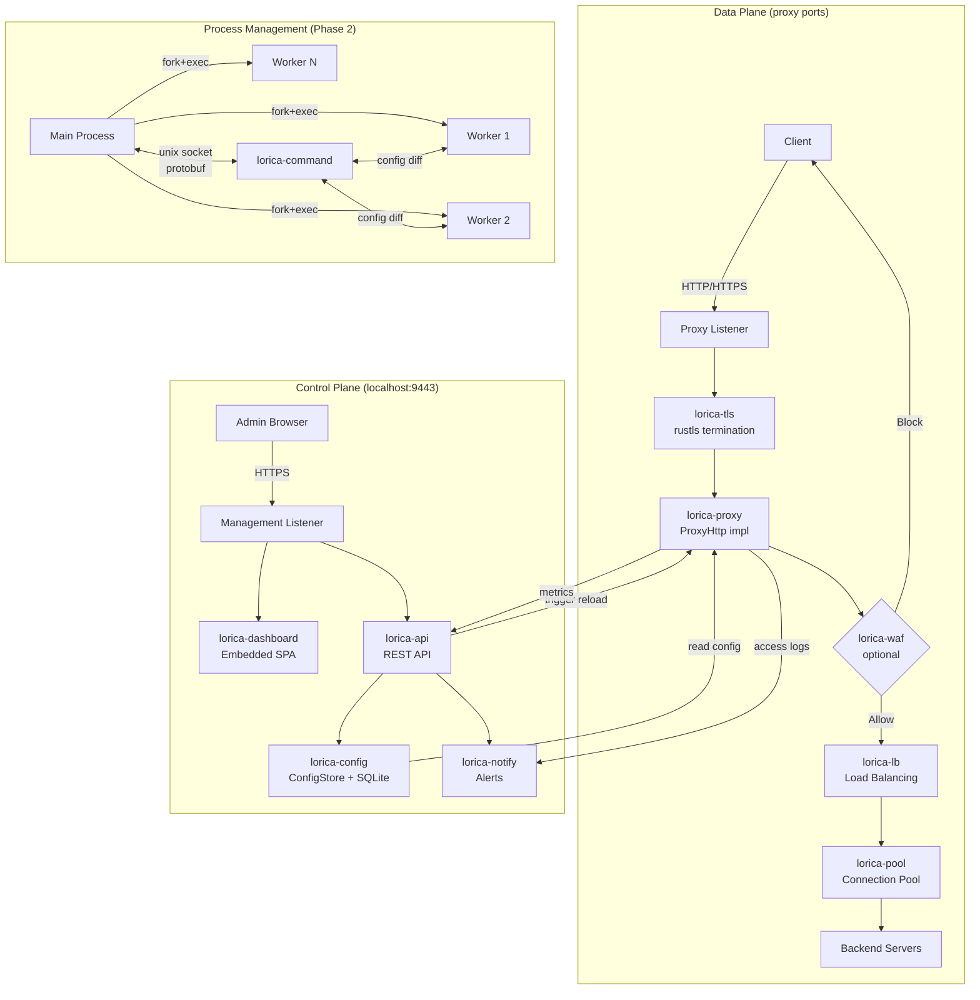

# Lorica Brownfield Enhancement Architecture

**Author:** Romain G.
**Date:** 2026-03-28
**Status:** Draft
**Version:** 1.0

---

## 1. Introduction

This document outlines the architectural approach for transforming Cloudflare's Pingora framework into Lorica, a dashboard-first, self-administered reverse proxy product. Its primary goal is to serve as the guiding architectural blueprint for AI-driven development of new features while ensuring seamless integration with the existing Pingora proxy engine.

**Relationship to Existing Architecture:**
This document supplements the Pingora framework architecture by defining how new product components (API, dashboard, config state, worker isolation, WAF) integrate with the existing proxy engine. Where conflicts arise between new patterns and Pingora's framework design, this document provides guidance on maintaining proxy engine integrity while building the product layer.

### 1.1 Existing Project Analysis

#### Current Project State

- **Primary Purpose:** Pingora is an HTTP proxy framework - a set of Rust libraries for building custom proxy servers. It is not a standalone product.
- **Current Tech Stack:** Rust 1.84+, tokio 1, h2, httparse, rustls/openssl/boringssl/s2n (multi-backend), serde, clap. 20-crate Cargo workspace.
- **Architecture Style:** Library/framework with trait-based extension points. Users implement the `ProxyHttp` trait to define proxy behavior in Rust code. No declarative configuration.
- **Deployment Method:** Compiled as part of a custom binary by the framework consumer. No standalone deployment.

#### Available Documentation

- `docs/brief.md` - Project brief with vision, positioning, and MVP scope
- `docs/prd.md` - Full PRD with 40 FRs, 12 NFRs, 4 epics, 17 stories
- `docs/brainstorming-session-results.md` - Design decisions from brainstorming

#### Identified Constraints

- Pingora's rustls backend is marked "experimental" - needs hardening
- Process isolation (fork+exec) is Unix-only - limits Windows support
- Sozu code is AGPL-3.0 - only concepts can be reimplemented, zero code copying
- serde_yaml 0.9 and nix 0.24 are deprecated - must be updated during fork
- Pingora has no config format, no API, no dashboard - entire product layer is new
- Single binary constraint means dashboard frontend must be embeddable (< 5MB assets)

### 1.2 Change Log

| Change | Date | Version | Description | Author |
|--------|------|---------|-------------|--------|
| Initial architecture | 2026-03-28 | 1.0 | First draft based on PRD and technical analysis | Romain G. |

---

## 2. Enhancement Scope and Integration Strategy

### 2.1 Enhancement Overview

**Enhancement Type:** Framework-to-product transformation
**Scope:** Strip unused Pingora components, add product layer (config, API, dashboard, WAF, worker isolation), rewire concurrency model
**Integration Impact:** Major - the proxy engine core stays intact, but it gets wrapped in entirely new infrastructure

### 2.2 Integration Approach

**Code Integration Strategy:** Pingora crates are forked and renamed (`pingora-*` -> `lorica-*`). The proxy engine internals remain largely untouched. New product crates (`lorica-config`, `lorica-api`, `lorica-dashboard`, etc.) wrap the engine and provide the product layer. The `ProxyHttp` trait implementation in the `lorica` binary crate bridges config state to proxy behavior.

**State Persistence Strategy:** New embedded SQLite database (WAL mode) managed by `lorica-config`. Pingora has no persistence - all state is new. No schema migration from an existing system.

**API Integration Strategy:** New REST API (`lorica-api`) served on the management port. Pingora has no API - this is entirely additive. The API is the single interface for all management operations; both the dashboard and CLI consume it.

**UI Integration Strategy:** New embedded dashboard (`lorica-dashboard`). Frontend assets compiled into the binary via `rust-embed`. Served on the management port (localhost:9443) alongside the API. Completely isolated from the proxy data plane.

### 2.3 Compatibility Requirements

- **Existing API Compatibility:** The `ProxyHttp` trait and core proxy abstractions (Peer, HttpPeer, TransportConnector) must remain functional. Custom filters/modules written against Pingora's API should work with minimal adaptation.
- **Database Schema Compatibility:** N/A - new database, no existing schema.
- **UI/UX Consistency:** N/A - no existing UI.
- **Performance Impact:** Product layer (API, dashboard, config reads) must not add measurable latency to the proxy hot path. Proxy data plane performance must remain at Pingora benchmark levels.

---

## 3. Tech Stack

### 3.1 Existing Technology Stack (from Pingora)

| Category | Current Technology | Version | Usage in Enhancement | Notes |
|----------|-------------------|---------|---------------------|-------|
| Language | Rust | 1.84+ (MSRV) | All components | Keep |
| Async Runtime | tokio | 1.x | Proxy engine, API server | Keep |
| HTTP/1.1 Parser | httparse | 1.x | Request/response parsing | Keep |
| HTTP/2 | h2 | >= 0.4.11 | HTTP/2 proxy | Keep |
| HTTP Types | http | 1.x | Type definitions | Keep |
| TLS | rustls | 0.23.12 | TLS termination | Keep - promote to sole backend |
| TLS Async | tokio-rustls | 0.26.0 | Async TLS | Keep |
| Crypto | ring | 0.17.12 | Cryptographic operations | Keep |
| Serialization | serde | 1.0 | Config, API payloads | Keep |
| CLI | clap | 4.5 | Binary CLI arguments | Keep |
| Concurrency | parking_lot | 0.12 | Fast mutexes/rwlocks | Keep |
| Atomic | arc-swap | 1.x | Atomic Arc swapping | Keep |
| Compression | flate2, brotli 3, zstd | Various | Response compression | Keep |
| Unix | nix | 0.24 -> **0.29+** | Syscalls, signals | **Upgrade** |
| YAML | serde_yaml | 0.9 | Server config | **Replace with serde_yml** |
| Socket | socket2 | Latest | Advanced socket ops | Keep |

### 3.2 New Technology Additions

| Technology | Version | Purpose | Rationale | Integration Method |
|------------|---------|---------|-----------|-------------------|
| axum | 0.7+ | REST API framework | Tokio-native, lightweight, tower middleware ecosystem | New `lorica-api` crate |
| tower | 0.4+ | HTTP middleware | Auth, rate limiting, CORS for API | Used by axum |
| SQLite (rusqlite) | Latest | Config state persistence | Battle-tested, crash-safe (WAL), zero-config, single-file | New `lorica-config` crate |
| rust-embed | Latest | Embed dashboard assets | Compile frontend into binary at build time | New `lorica-dashboard` crate |
| tracing | 0.1+ | Structured logging | Standard Rust ecosystem, JSON output, spans | Replace `log` crate usage |
| tracing-subscriber | 0.3+ | Log formatting | JSON formatter for stdout | Companion to tracing |
| prost | Latest | Protobuf serialization | Command channel protocol (Phase 2) | New `lorica-command` crate |
| sysinfo | Latest | System metrics | CPU, RAM, disk usage for dashboard | New dependency in `lorica-api` |
| argon2 | Latest | Password hashing | Secure admin password storage | New dependency in `lorica-api` |
| toml | Latest | Config export/import | TOML serialization for config files | New dependency in `lorica-config` |
| Frontend TBD | - | Dashboard UI | Svelte, Solid, or htmx - evaluate for bundle size | Build artifact embedded via rust-embed |

---

## 4. Data Models and Schema Changes

### 4.1 New Data Models

#### Route

**Purpose:** Defines a proxy route mapping incoming requests to backend servers.
**Integration:** Read by the `ProxyHttp` implementation to make routing decisions. Stored in SQLite, loaded into memory at startup and updated via command channel.

**Key Attributes:**
- `id`: TEXT (UUID) - Primary key
- `hostname`: TEXT - Incoming hostname to match (e.g., `example.com`)
- `path_prefix`: TEXT - Path prefix to match (default: `/`)
- `certificate_id`: TEXT (nullable, FK) - Associated TLS certificate
- `load_balancing`: TEXT - Algorithm: `round_robin`, `consistent_hash`, `random`, `peak_ewma`
- `waf_enabled`: BOOLEAN - Whether WAF is active for this route
- `waf_mode`: TEXT - `detection` or `blocking` (when WAF enabled)
- `topology_type`: TEXT - `single_vm`, `ha`, `docker_swarm`, `kubernetes`, `custom`
- `enabled`: BOOLEAN - Whether the route is active
- `created_at`: TIMESTAMP
- `updated_at`: TIMESTAMP

**Relationships:**
- Has many Backends (via route_backends join)
- Belongs to one Certificate (optional)

#### Backend

**Purpose:** Represents an upstream server that receives proxied traffic.
**Integration:** Mapped to Pingora's `HttpPeer` for connection establishment. Health status tracked and reflected in load balancing decisions.

**Key Attributes:**
- `id`: TEXT (UUID) - Primary key
- `address`: TEXT - Backend address (e.g., `192.168.1.10:8080`)
- `weight`: INTEGER - Load balancing weight (default: 100)
- `health_status`: TEXT - `healthy`, `degraded`, `down`
- `health_check_enabled`: BOOLEAN - Whether active health checks run
- `health_check_interval_s`: INTEGER - Seconds between checks (default: 10)
- `lifecycle_state`: TEXT - `normal`, `closing`, `closed`
- `active_connections`: INTEGER - Current connection count
- `tls_upstream`: BOOLEAN - Whether to use TLS to connect to backend
- `created_at`: TIMESTAMP
- `updated_at`: TIMESTAMP

**Relationships:**
- Belongs to many Routes (via route_backends join)

#### Certificate

**Purpose:** Stores TLS certificates for termination.
**Integration:** Loaded into rustls `CertifiedKey` structures. Indexed by SNI trie for fast lookup during TLS handshake.

**Key Attributes:**
- `id`: TEXT (UUID) - Primary key
- `domain`: TEXT - Primary domain (e.g., `example.com`)
- `san_domains`: TEXT (JSON array) - Subject Alternative Names
- `fingerprint`: TEXT - SHA256 fingerprint
- `cert_pem`: BLOB - Certificate chain PEM
- `key_pem`: BLOB (encrypted at rest) - Private key PEM
- `issuer`: TEXT - Certificate issuer
- `not_before`: TIMESTAMP - Validity start
- `not_after`: TIMESTAMP - Validity end
- `is_acme`: BOOLEAN - Whether managed by ACME
- `acme_auto_renew`: BOOLEAN - Whether to auto-renew
- `created_at`: TIMESTAMP

**Relationships:**
- Has many Routes

#### NotificationConfig

**Purpose:** Configures notification channels and alert preferences.
**Integration:** Checked by the notification system when events occur.

**Key Attributes:**
- `id`: TEXT (UUID) - Primary key
- `channel`: TEXT - `email` or `webhook`
- `enabled`: BOOLEAN
- `config`: TEXT (JSON) - Channel-specific config (SMTP settings, webhook URL)
- `alert_types`: TEXT (JSON array) - Which event types trigger this channel

#### UserPreference

**Purpose:** Stores consent-driven preferences (never/always/once decisions).
**Integration:** Checked before any automated action to determine if consent is needed.

**Key Attributes:**
- `id`: TEXT (UUID) - Primary key
- `preference_key`: TEXT - Unique identifier (e.g., `self_signed_cert`, `acme_renewal`)
- `value`: TEXT - `never`, `always`, `once`
- `created_at`: TIMESTAMP
- `updated_at`: TIMESTAMP

#### AdminUser

**Purpose:** Dashboard admin account.
**Integration:** Used by API authentication middleware.

**Key Attributes:**
- `id`: TEXT (UUID) - Primary key
- `username`: TEXT - Admin username (default: `admin`)
- `password_hash`: TEXT - Argon2 hash
- `must_change_password`: BOOLEAN - True on first run
- `created_at`: TIMESTAMP
- `last_login`: TIMESTAMP

### 4.2 Schema Integration Strategy

**Database Changes Required:**
- **New Tables:** `routes`, `backends`, `route_backends` (join), `certificates`, `notification_configs`, `user_preferences`, `admin_users`, `schema_migrations`
- **Modified Tables:** None (new database)
- **New Indexes:** `idx_routes_hostname`, `idx_backends_health_status`, `idx_certificates_domain`, `idx_certificates_not_after`
- **Migration Strategy:** Embedded migrations using a simple version table (`schema_migrations`). Migrations run automatically on startup. Each migration is a SQL file compiled into the binary.

**Backward Compatibility:**
- TOML export format is versioned (field `version` in export file)
- Lorica can import any prior TOML format version (forward-compatible reader)
- Database schema changes between versions are handled by auto-migrations

---

## 5. Component Architecture

### 5.1 New Components

#### lorica (binary)

**Responsibility:** Main entry point. CLI parsing, orchestration of all components, systemd integration.
**Integration Points:** Starts the proxy engine, API server, and worker processes. Implements `ProxyHttp` trait to bridge config state to proxy behavior.

**Key Interfaces:**
- CLI interface (clap): `--version`, `--data-dir`, `--log-level`, `--management-port`
- Signal handlers: SIGTERM (graceful shutdown), SIGQUIT (graceful upgrade), SIGINT (fast shutdown)

**Dependencies:**
- **Existing Components:** lorica-core, lorica-proxy, lorica-runtime, lorica-tls, lorica-lb
- **New Components:** lorica-config, lorica-api, lorica-dashboard, lorica-worker (Phase 2), lorica-command (Phase 2)

**Technology Stack:** Rust, clap, tracing

#### lorica-config

**Responsibility:** Configuration state management - data models, CRUD operations, persistence, export/import, diff generation.
**Integration Points:** Read by the ProxyHttp implementation for routing decisions. Written by the API. Diffed by the command channel for hot-reload.

**Key Interfaces:**
- `ConfigStore` - CRUD operations for all entities
- `ConfigState` - In-memory snapshot of all configuration
- `ConfigDiff` - Compare two states, produce minimal changeset
- `export_toml()` / `import_toml()` - Serialization for backup/sharing

**Dependencies:**
- **Existing Components:** None (standalone)
- **New Components:** None

**Technology Stack:** Rust, rusqlite, serde, toml

#### lorica-api

**Responsibility:** REST API server on the management port. Authentication, session management, all CRUD endpoints.
**Integration Points:** Reads/writes config via lorica-config. Triggers proxy reconfiguration. Serves alongside dashboard on management port.

**Key Interfaces:**
- REST endpoints (see PRD section 4 for full list)
- Auth middleware (session-based, argon2 password hashing)
- Management listener (localhost:9443)

**Dependencies:**
- **Existing Components:** lorica-core (for listener setup)
- **New Components:** lorica-config, lorica-dashboard, lorica-notify

**Technology Stack:** Rust, axum, tower, argon2, sysinfo

#### lorica-dashboard

**Responsibility:** Frontend web application embedded in the binary. Consumes the REST API.
**Integration Points:** Static assets served by lorica-api on the management port. Pure API consumer - no direct access to backend systems.

**Key Interfaces:**
- HTTP routes: `GET /` serves the SPA, `GET /assets/*` serves static files
- All data operations go through `/api/*` endpoints

**Dependencies:**
- **Existing Components:** None
- **New Components:** lorica-api (runtime consumer)

**Technology Stack:** Frontend framework TBD (Svelte/Solid/htmx), rust-embed

#### lorica-command (Phase 2)

**Responsibility:** Command channel for hot-reload. Unix socket communication between main process and workers. Protobuf message protocol.
**Integration Points:** Main process sends config diffs to workers. Workers apply changes without restart.

**Key Interfaces:**
- `Channel<Tx, Rx>` - Typed bidirectional channel over unix socket
- Message types: ConfigUpdate, WorkerStatus, HealthReport
- Response protocol: Ok, Error, Processing

**Dependencies:**
- **Existing Components:** lorica-core (unix socket setup)
- **New Components:** lorica-config (for ConfigDiff)

**Technology Stack:** Rust, prost (protobuf), nix (unix sockets, SCM_RIGHTS)

#### lorica-worker (Phase 2)

**Responsibility:** Process-based worker isolation. Fork+exec of worker processes, FD passing, worker lifecycle management.
**Integration Points:** Main process creates workers, passes listening socket FDs, monitors worker health.

**Key Interfaces:**
- `WorkerManager` - Create, monitor, restart workers
- Worker binary mode: `lorica worker --id <id> --fd <fd> --scm <scm_fd>`
- FD passing via SCM_RIGHTS

**Dependencies:**
- **Existing Components:** lorica-core (listener FDs, server lifecycle)
- **New Components:** lorica-command

**Technology Stack:** Rust, nix (fork, exec, SCM_RIGHTS)

#### lorica-waf (Phase 2+)

**Responsibility:** Optional WAF engine. Load and evaluate OWASP CRS rules against incoming requests.
**Integration Points:** Called from the `ProxyHttp::request_filter()` phase. Evaluation result determines whether to proxy or block.

**Key Interfaces:**
- `WafEngine` - Load rules, evaluate request
- `WafResult` - Allow, Block(rule_id), Detect(rule_id)
- Rule loading from bundled/updated OWASP CRS files

**Dependencies:**
- **Existing Components:** lorica-http (request types)
- **New Components:** lorica-config (WAF enable/mode per route)

**Technology Stack:** Rust, OWASP CRS rule parser (custom)

#### lorica-notify

**Responsibility:** Notification dispatch. Routes alert events to configured channels (stdout, email, webhook).
**Integration Points:** Called by any component that generates alerts (cert expiry, backend down, WAF events).

**Key Interfaces:**
- `Notifier` - Dispatch an alert event
- `AlertEvent` - Typed event (CertExpiring, BackendDown, WafAlert, ConfigChanged)
- Channel implementations: StdoutChannel, EmailChannel, WebhookChannel

**Dependencies:**
- **Existing Components:** None
- **New Components:** lorica-config (notification preferences)

**Technology Stack:** Rust, lettre (SMTP), reqwest (webhook HTTP client)

### 5.2 Component Interaction Diagram



---

## 6. API Design and Integration

### 6.1 API Integration Strategy

**API Integration Strategy:** REST API over HTTPS on the management port. JSON request/response bodies. All state mutations go through the API - the dashboard and any future CLI are pure consumers.

**Authentication:** Session-based. Login returns an HTTP-only secure cookie. Sessions stored in-memory with configurable timeout (default: 30 minutes). Rate limiting on login endpoint (5 attempts per minute).

**Versioning:** API path prefix `/api/v1/`. Version bump only on breaking changes. Non-breaking additions (new fields, new endpoints) don't require version bump.

### 6.2 API Endpoints

#### Authentication

**POST /api/v1/auth/login**
- **Purpose:** Authenticate admin and create session
- **Request:**
```json
{
  "username": "admin",
  "password": "string"
}
```
- **Response:**
```json
{
  "must_change_password": false,
  "session_expires_at": "2026-03-28T22:00:00Z"
}
```

**PUT /api/v1/auth/password**
- **Purpose:** Change admin password (required on first login)
- **Request:**
```json
{
  "current_password": "string",
  "new_password": "string"
}
```
- **Response:**
```json
{
  "message": "Password updated"
}
```

#### Routes

**GET /api/v1/routes**
- **Purpose:** List all configured routes
- **Response:**
```json
{
  "routes": [
    {
      "id": "uuid",
      "hostname": "example.com",
      "path_prefix": "/",
      "backends": ["uuid1", "uuid2"],
      "certificate_id": "uuid",
      "load_balancing": "round_robin",
      "waf_enabled": false,
      "topology_type": "single_vm",
      "enabled": true,
      "health_summary": {"healthy": 2, "degraded": 0, "down": 0}
    }
  ]
}
```

**POST /api/v1/routes**
- **Purpose:** Create a new route
- **Request:**
```json
{
  "hostname": "example.com",
  "path_prefix": "/",
  "backend_ids": ["uuid1"],
  "certificate_id": "uuid",
  "load_balancing": "round_robin",
  "topology_type": "single_vm"
}
```
- **Response:** Created route object (201)

**GET /api/v1/routes/:id**
- **Purpose:** Get route details with full backend and cert info

**PUT /api/v1/routes/:id**
- **Purpose:** Update route configuration

**DELETE /api/v1/routes/:id**
- **Purpose:** Delete route (with confirmation token to prevent accidental deletion)

#### Backends

**GET /api/v1/backends**
- **Purpose:** List all backends with health status

**POST /api/v1/backends**
- **Purpose:** Add a new backend
- **Request:**
```json
{
  "address": "192.168.1.10:8080",
  "weight": 100,
  "health_check_enabled": true,
  "health_check_interval_s": 10,
  "tls_upstream": false
}
```

**GET /api/v1/backends/:id**
- **Purpose:** Get backend details including metrics

**PUT /api/v1/backends/:id**
- **Purpose:** Update backend configuration

**DELETE /api/v1/backends/:id**
- **Purpose:** Remove backend (triggers graceful drain if active connections exist)

#### Certificates

**GET /api/v1/certificates**
- **Purpose:** List all certificates with expiry status

**POST /api/v1/certificates**
- **Purpose:** Upload a certificate (multipart: cert PEM + key PEM)

**GET /api/v1/certificates/:id**
- **Purpose:** Get certificate details (chain, domains, expiry)

**DELETE /api/v1/certificates/:id**
- **Purpose:** Delete certificate (blocked if routes still reference it)

#### Status & System

**GET /api/v1/status**
- **Purpose:** Overall proxy status (routes count, backends health, certs expiry, uptime)

**GET /api/v1/system**
- **Purpose:** Host system metrics (CPU, RAM, disk, process metrics)

**GET /api/v1/logs**
- **Purpose:** Query access logs (params: route_id, status_code, time_from, time_to, search, limit, offset)

**GET /api/v1/metrics**
- **Purpose:** Prometheus-formatted metrics endpoint

#### Configuration

**POST /api/v1/config/export**
- **Purpose:** Export full configuration as TOML
- **Response:** TOML file download

**POST /api/v1/config/import**
- **Purpose:** Import configuration from TOML (multipart upload)
- **Request:** TOML file upload
- **Response:** Preview of changes (added, modified, removed) - requires subsequent confirmation

**POST /api/v1/config/import/confirm**
- **Purpose:** Confirm and apply a previewed import

---

## 7. Source Tree

### 7.1 Workspace Structure

```
lorica/
  Cargo.toml                    # Workspace root
  NOTICE                        # Cloudflare Pingora attribution
  LICENSE                       # Apache-2.0
  CHANGELOG.md
  README.md

  lorica/                       # Main binary crate
    Cargo.toml
    src/
      main.rs                   # Entry point, CLI, orchestration
      proxy.rs                  # ProxyHttp trait implementation
      signals.rs                # Signal handling (SIGTERM, SIGQUIT, SIGINT)

  lorica-core/                  # Fork of pingora-core
    Cargo.toml
    src/                        # (preserved Pingora structure)
      server/
      protocols/
      connectors/
      listeners/
      apps/
      services/
      modules/
      upstreams/

  lorica-proxy/                 # Fork of pingora-proxy
  lorica-http/                  # Fork of pingora-http
  lorica-error/                 # Fork of pingora-error
  lorica-pool/                  # Fork of pingora-pool
  lorica-runtime/               # Fork of pingora-runtime
  lorica-timeout/               # Fork of pingora-timeout
  lorica-tls/                   # Fork of pingora-rustls (sole TLS backend)
  lorica-lb/                    # Fork of pingora-load-balancing
  lorica-ketama/                # Fork of pingora-ketama
  lorica-limits/                # Fork of pingora-limits
  lorica-header-serde/          # Fork of pingora-header-serde

  lorica-config/                # NEW - Config state & persistence
    Cargo.toml
    src/
      lib.rs
      models.rs                 # Route, Backend, Certificate, etc.
      store.rs                  # ConfigStore - CRUD operations
      state.rs                  # ConfigState - in-memory snapshot
      diff.rs                   # ConfigDiff - minimal changeset generation
      export.rs                 # TOML export
      import.rs                 # TOML import + validation
      migrations/               # SQL migration files
        001_initial.sql

  lorica-api/                   # NEW - REST API
    Cargo.toml
    src/
      lib.rs
      server.rs                 # axum server setup, management listener
      auth.rs                   # Login, sessions, password management
      routes.rs                 # /api/v1/routes endpoints
      backends.rs               # /api/v1/backends endpoints
      certificates.rs           # /api/v1/certificates endpoints
      status.rs                 # /api/v1/status, /api/v1/system
      logs.rs                   # /api/v1/logs endpoint
      config.rs                 # /api/v1/config/export, import
      middleware/
        auth.rs                 # Session validation middleware
        rate_limit.rs           # Rate limiting for login

  lorica-dashboard/             # NEW - Embedded frontend
    Cargo.toml
    src/
      lib.rs                    # rust-embed setup, asset serving
    frontend/                   # Frontend project (Svelte/Solid/htmx)
      package.json
      src/
      dist/                     # Build output - embedded by rust-embed

  lorica-command/               # NEW (Phase 2) - Command channel
    Cargo.toml
    src/
      lib.rs
      channel.rs                # Unix socket channel with protobuf framing
      messages.rs               # Protobuf message definitions
      proto/
        command.proto           # Protobuf schema

  lorica-worker/                # NEW (Phase 2) - Process isolation
    Cargo.toml
    src/
      lib.rs
      manager.rs                # WorkerManager - fork, monitor, restart
      fd_passing.rs             # SCM_RIGHTS FD transfer

  lorica-waf/                   # NEW (Phase 2+) - WAF engine
    Cargo.toml
    src/
      lib.rs
      engine.rs                 # Rule evaluation engine
      rules.rs                  # OWASP CRS rule parsing
      data/
        owasp-crs/              # Bundled rulesets

  lorica-notify/                # NEW - Notification channels
    Cargo.toml
    src/
      lib.rs
      events.rs                 # AlertEvent types
      channels/
        stdout.rs               # JSON structured log events
        email.rs                # SMTP notifications
        webhook.rs              # HTTP webhook notifications

  dist/                         # Distribution files
    lorica.service              # systemd unit file
    debian/                     # .deb package config

  tests/                        # Integration tests
  e2e/                          # End-to-end tests
  docs/                         # Project documentation
```

### 7.2 Integration Guidelines

- **File Naming:** snake_case for all Rust files, matching Pingora convention. Frontend follows its framework's convention.
- **Folder Organization:** Each concern in its own crate. Forked crates preserve Pingora's internal structure. New crates follow Rust module conventions.
- **Import/Export Patterns:** All inter-crate dependencies via Cargo.toml. No circular dependencies. Forked crates depend on other forked crates. New crates depend on forked crates but not vice versa (product layer wraps engine, engine doesn't know about product).

---

## 8. Infrastructure and Deployment

### 8.1 Existing Infrastructure

**Current Deployment:** N/A - new product. Target: Linux servers managed by the author.
**Infrastructure Tools:** systemd for service management, apt for package management.
**Environments:** Production only (single-purpose tool, no staging needed for the proxy itself).

### 8.2 Enhancement Deployment Strategy

**Deployment Approach:**
1. Primary: `.deb` package via apt repository
2. Secondary: Static binary download from GitHub releases
3. Future: Docker image, RPM package

**Infrastructure Changes:**
- systemd service file (`lorica.service`) with security hardening directives
- Data directory: `/var/lib/lorica/` (SQLite database, runtime state)
- Log output: stdout captured by systemd journal

**Pipeline Integration:**
- GitHub Actions for CI (cargo test, cargo clippy, cargo fmt --check)
- GitHub Actions for release builds (x86_64 only)
- GitHub Actions for .deb package building and apt repository publishing

### 8.3 Rollback Strategy

**Rollback Method:** `apt install lorica=<previous-version>`. Database migrations are forward-only but designed to be non-destructive (additive columns, new tables). In worst case, restore database from TOML export backup.

**Risk Mitigation:**
- Auto-backup of database before migration on upgrade
- TOML export triggered automatically before package upgrade (post-install script)
- Binary is statically linked - no shared library version conflicts

**Monitoring:** Structured JSON logs to stdout -> journald -> SIEM/XDR. Prometheus endpoint for metrics scraping. Dashboard for visual monitoring.

---

## 9. Coding Standards

### 9.1 Existing Standards Compliance (from Pingora)

**Code Style:** Standard Rust idioms. No custom style guide in Pingora beyond standard rustfmt.
**Linting Rules:** `cargo clippy` with default lints. Lorica will add `#![deny(clippy::all)]`.
**Testing Patterns:** Unit tests in `#[cfg(test)]` modules within source files. Integration tests in `tests/` directory.
**Documentation Style:** `///` doc comments on public items. Pingora has moderate documentation coverage.

### 9.2 Enhancement-Specific Standards

- **API Response Format:** All API responses use a consistent JSON envelope: `{"data": ...}` for success, `{"error": {"code": "...", "message": "..."}}` for errors.
- **Error Handling:** Use `thiserror` for typed errors in library crates. Map to HTTP status codes in API layer. Never expose internal error details to API consumers.
- **Database Access:** All database operations go through `ConfigStore`. No raw SQL outside of migration files and the store module.
- **Frontend Build:** Frontend build must produce deterministic output. Embedded assets are part of the binary's reproducible build.

### 9.3 Critical Integration Rules

- **Existing API Compatibility:** Changes to forked crates must not break the `ProxyHttp` trait or `Peer`/`HttpPeer` abstractions. If a breaking change is needed, it goes through a deprecation cycle.
- **Database Integration:** All schema changes are migrations. No manual DDL. WAL mode is mandatory for crash safety.
- **Error Handling:** Proxy engine errors (forked crates) use `pingora_error::Error` (renamed to `lorica_error::Error`). Product layer errors use `thiserror`-derived types. Bridge at the `ProxyHttp` implementation boundary.
- **Logging Consistency:** All components use `tracing` macros (`info!`, `warn!`, `error!`). Structured fields for machine-parseable output. No `println!` or `eprintln!` in production code.

---

## 10. Testing Strategy

### 10.1 Integration with Existing Tests

**Existing Test Framework:** Rust's built-in test framework (`#[test]`, `#[tokio::test]`). Pingora has unit tests across crates.
**Test Organization:** Unit tests in-module, integration tests in `tests/` per crate.
**Coverage Requirements:** No formal coverage target. Prioritize: config CRUD, API endpoints, TLS handling, routing logic, WAF rule evaluation.

### 10.2 New Testing Requirements

#### Unit Tests

- **Framework:** Rust built-in `#[test]` and `#[tokio::test]`
- **Location:** `#[cfg(test)]` modules in each source file
- **Coverage Target:** All public functions in new crates. All API endpoint handlers. All config CRUD operations. All export/import round-trips.
- **Integration with Existing:** Forked crate tests must continue passing. New tests don't depend on forked crate internals.

#### Integration Tests

- **Scope:** API endpoint tests (HTTP requests to running API server), proxy routing tests (HTTP traffic through proxy), config persistence tests (write, restart, read).
- **Existing System Verification:** Pingora proxy engine tests remain functional after fork and rename.
- **New Feature Testing:** Full proxy lifecycle: create route via API -> verify traffic is proxied -> update route -> verify change -> delete route -> verify traffic stops.

#### Regression Testing

- **Existing Feature Verification:** `cargo test` across all workspace crates before each release.
- **Automated Regression Suite:** E2E test suite that stands up a Lorica instance, configures routes via API, sends traffic, and verifies behavior.
- **Manual Testing Requirements:** TLS certificate handling edge cases (expired certs, wildcard matching, SNI fallback). Dashboard UX verification on target browsers.

---

## 11. Security Integration

### 11.1 Existing Security Measures (Pingora)

**Authentication:** None (framework, no user-facing auth)
**Authorization:** None
**Data Protection:** TLS termination via rustls. Connection pooling prevents upstream credential leakage.
**Security Tools:** None built-in. Relies on consumer implementation.

### 11.2 Enhancement Security Requirements

**New Security Measures:**
- Admin authentication with argon2 password hashing
- Session-based auth with HTTP-only secure cookies
- Rate limiting on login endpoint (brute-force protection)
- Management port bound to localhost only (non-configurable)
- Private key material encrypted at rest in SQLite
- WAF engine for request inspection (Phase 2+)
- Structured security event logging for SIEM integration

**Integration Points:**
- Auth middleware in axum tower stack
- WAF evaluation in `ProxyHttp::request_filter()` phase
- Notification system for security events

**Compliance Requirements:**
- No secrets in logs (private keys, passwords masked)
- No secrets in TOML export (private keys exported separately or encrypted)
- Dependency auditing via `cargo audit` in CI

### 11.3 Security Testing

**Existing Security Tests:** None in Pingora (framework responsibility delegated to consumer)
**New Security Test Requirements:**
- Auth bypass attempts (invalid sessions, expired cookies, missing tokens)
- SQL injection on API endpoints (parameterized queries should prevent)
- Path traversal on dashboard asset serving
- TLS configuration validation (no weak ciphers, no TLS < 1.2)
- Rate limiting verification under concurrent login attempts
**Penetration Testing:** Manual security review before first production deployment. Fuzz testing for TLS handshake and HTTP parsing paths.

---

## 12. Checklist Results Report

Architecture checklist to be executed before implementation begins. Key validation points:

- [ ] All forked crate renames compile and pass tests
- [ ] rustls promoted to sole TLS backend without compile errors
- [ ] SQLite WAL mode provides adequate crash safety for config state
- [ ] axum integrates cleanly with tokio runtime from lorica-runtime
- [ ] rust-embed produces acceptable binary size (< 50MB total)
- [ ] Frontend framework selected based on bundle size evaluation
- [ ] Management port binding to localhost verified at OS level
- [ ] ProxyHttp trait implementation correctly bridges config state to routing
- [ ] TOML export/import round-trip preserves all configuration state
- [ ] Graceful restart (FD transfer) works with new product layer

---

## 13. Next Steps

### 13.1 Story Manager Handoff

This architecture document defines the technical blueprint for Lorica. Key integration requirements:

- **Architecture reference:** `docs/architecture.md` (this document)
- **PRD reference:** `docs/prd.md` (requirements and stories)
- **Critical constraint:** Proxy engine (forked crates) must remain functional at all times. Each story adds product layer without breaking proxy.
- **First story:** Story 1.1 (Fork and Strip Pingora) - foundation for everything else
- **Integration checkpoints:** After each story, verify `cargo test` passes across all workspace crates

Story implementation should follow Epic 1 sequentially (1.1 -> 1.2 -> ... -> 1.10). Stories within Epics 2-4 can be parallelized where dependencies allow.

### 13.2 Developer Handoff

Implementation guide for Lorica development:

- **Architecture:** `docs/architecture.md` - component responsibilities, data models, API design
- **Coding standards:** Rust strict clippy, rustfmt, tracing for logging, thiserror for errors, doc comments on public APIs
- **Integration rules:** Product layer wraps engine (new crates depend on forked crates, never reverse). All state through ConfigStore. All operations through API.
- **Compatibility:** ProxyHttp trait, Peer/HttpPeer abstractions must not break. Forked crate tests must pass.
- **Implementation order:**
  1. Fork and strip (Story 1.1) - establish the codebase
  2. Binary and logging (Story 1.2) - bootable binary
  3. Config persistence (Story 1.3) - data layer
  4. REST API (Story 1.4) - control interface
  5. Dashboard skeleton (Story 1.5) - visual interface
  6. Route management UI (Story 1.6) - first user-facing feature
  7. Certificate management (Story 1.7) - TLS management
  8. Proxy wiring (Story 1.8) - connect config to proxy engine
  9. Logs and monitoring (Story 1.9) - observability
  10. Settings and export/import (Story 1.10) - config lifecycle
- **Risk mitigation:** Run `cargo test` after every significant change. Keep forked crate modifications minimal in Epic 1. Document any Pingora internal changes in commit messages.
