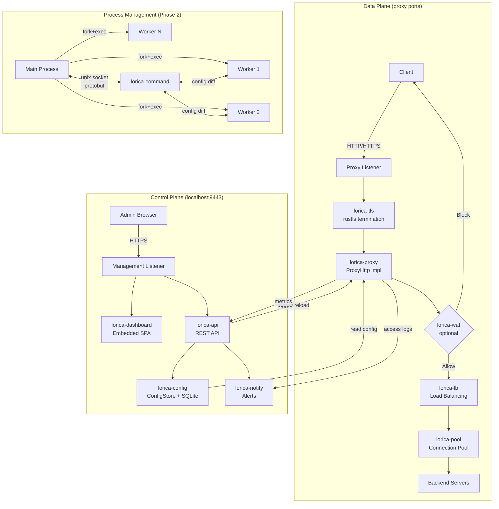

# Component Architecture

## New Components

### lorica (binary)

**Responsibility:** Main entry point. CLI parsing, orchestration of all components, systemd integration.
**Integration Points:** Starts the proxy engine, API server, and worker processes. Implements `ProxyHttp` trait to bridge config state to proxy behavior.

**Key Interfaces:**
- CLI interface (clap): `--version`, `--data-dir`, `--log-level`, `--management-port`
- Signal handlers: SIGTERM (graceful shutdown), SIGQUIT (graceful upgrade), SIGINT (fast shutdown)

**Dependencies:**
- **Existing Components:** lorica-core, lorica-proxy, lorica-runtime, lorica-tls, lorica-lb
- **New Components:** lorica-config, lorica-api, lorica-dashboard, lorica-worker (Phase 2), lorica-command (Phase 2)

**Technology Stack:** Rust, clap, tracing

### lorica-config

**Responsibility:** Configuration state management - data models, CRUD operations, persistence, export/import, diff generation.
**Integration Points:** Read by the ProxyHttp implementation for routing decisions. Written by the API. Diffed by the command channel for hot-reload.

**Key Interfaces:**
- `ConfigStore` - CRUD operations for all entities
- `ConfigState` - In-memory snapshot of all configuration
- `ConfigDiff` - Compare two states, produce minimal changeset
- `export_toml()` / `import_toml()` - Serialization for backup/sharing

**Dependencies:**
- **Existing Components:** None (standalone)
- **New Components:** None

**Technology Stack:** Rust, rusqlite, serde, toml

### lorica-api

**Responsibility:** REST API server on the management port. Authentication, session management, all CRUD endpoints.
**Integration Points:** Reads/writes config via lorica-config. Triggers proxy reconfiguration. Serves alongside dashboard on management port.

**Key Interfaces:**
- REST endpoints (see PRD section 4 for full list)
- Auth middleware (session-based, argon2 password hashing)
- Management listener (localhost:9443)

**Dependencies:**
- **Existing Components:** lorica-core (for listener setup)
- **New Components:** lorica-config, lorica-dashboard, lorica-notify

**Technology Stack:** Rust, axum, tower, argon2, sysinfo

### lorica-dashboard

**Responsibility:** Frontend web application embedded in the binary. Consumes the REST API.
**Integration Points:** Static assets served by lorica-api on the management port. Pure API consumer - no direct access to backend systems.

**Key Interfaces:**
- HTTP routes: `GET /` serves the SPA, `GET /assets/*` serves static files
- All data operations go through `/api/*` endpoints

**Dependencies:**
- **Existing Components:** None
- **New Components:** lorica-api (runtime consumer)

**Technology Stack:** Frontend framework TBD (Svelte/Solid/htmx), rust-embed

### lorica-command (Phase 2)

**Responsibility:** Command channel for hot-reload. Unix socket communication between main process and workers. Protobuf message protocol.
**Integration Points:** Main process sends config diffs to workers. Workers apply changes without restart.

**Key Interfaces:**
- `Channel<Tx, Rx>` - Typed bidirectional channel over unix socket
- Message types: ConfigUpdate, WorkerStatus, HealthReport
- Response protocol: Ok, Error, Processing

**Dependencies:**
- **Existing Components:** lorica-core (unix socket setup)
- **New Components:** lorica-config (for ConfigDiff)

**Technology Stack:** Rust, prost (protobuf), nix (unix sockets, SCM_RIGHTS)

### lorica-worker (Phase 2)

**Responsibility:** Process-based worker isolation. Fork+exec of worker processes, FD passing, worker lifecycle management.
**Integration Points:** Main process creates workers, passes listening socket FDs, monitors worker health.

**Key Interfaces:**
- `WorkerManager` - Create, monitor, restart workers
- Worker binary mode: `lorica worker --id <id> --fd <fd> --scm <scm_fd>`
- FD passing via SCM_RIGHTS

**Dependencies:**
- **Existing Components:** lorica-core (listener FDs, server lifecycle)
- **New Components:** lorica-command

**Technology Stack:** Rust, nix (fork, exec, SCM_RIGHTS)

### lorica-waf (Phase 2+)

**Responsibility:** Optional WAF engine. Load and evaluate OWASP CRS rules against incoming requests.
**Integration Points:** Called from the `ProxyHttp::request_filter()` phase. Evaluation result determines whether to proxy or block.

**Key Interfaces:**
- `WafEngine` - Load rules, evaluate request
- `WafResult` - Allow, Block(rule_id), Detect(rule_id)
- Rule loading from bundled/updated OWASP CRS files

**Dependencies:**
- **Existing Components:** lorica-http (request types)
- **New Components:** lorica-config (WAF enable/mode per route)

**Technology Stack:** Rust, OWASP CRS rule parser (custom)

### lorica-notify

**Responsibility:** Notification dispatch. Routes alert events to configured channels (stdout, email, webhook).
**Integration Points:** Called by any component that generates alerts (cert expiry, backend down, WAF events).

**Key Interfaces:**
- `Notifier` - Dispatch an alert event
- `AlertEvent` - Typed event (CertExpiring, BackendDown, WafAlert, ConfigChanged)
- Channel implementations: StdoutChannel, EmailChannel, WebhookChannel

**Dependencies:**
- **Existing Components:** None
- **New Components:** lorica-config (notification preferences)

**Technology Stack:** Rust, lettre (SMTP), reqwest (webhook HTTP client)

### lorica-bench (Phase 3+)

**Responsibility:** SLA monitoring (passive + active) and built-in load testing engine.
**Integration Points:** Passive SLA hooks into ProxyHttp logging phase. Active probes and load tests generate HTTP traffic directly to backends. Results stored via lorica-config.

**Key Interfaces:**
- `PassiveSlaCollector` - Collects metrics from real traffic in ProxyHttp logging callback
- `ActiveProber` - Sends synthetic HTTP probes at configurable intervals
- `LoadTestEngine` - Generates simulated concurrent HTTP traffic to backends
- `SlaReport` - Computes SLA percentages (passive/active) over time windows
- `LoadTestResult` - Latency histograms, throughput, error rates, with historical comparison

**Dependencies:**
- **Existing Components:** lorica-core (HTTP client for probes/load tests), lorica-proxy (logging hook)
- **New Components:** lorica-config (result persistence, test scheduling), lorica-notify (SLA alerts)

**Technology Stack:** Rust, tokio (async task scheduling), hdrhistogram (latency percentiles), reqwest or hyper (HTTP client for probes/load tests)

## Component Interaction Diagram

