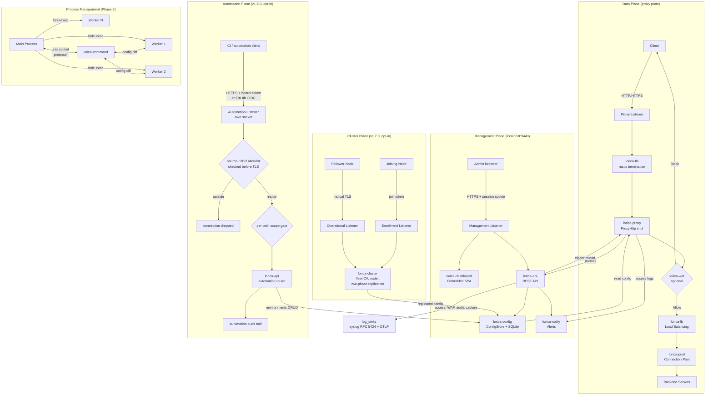

# Component Architecture

> **Baseline note.** This is the v1.0 planning decomposition (the
> "Phase 2 / Phase 3" markers are the original roadmap phasing). The
> workspace has since grown to 31 members; components added after this
> blueprint and not described below include `lorica-acme` (pure ACME
> core: DNS challengers + instant-acme driver), `lorica-metrics` (shared
> Prometheus registry + cross-worker counter aggregation),
> `lorica-cluster` (the v1.7.0 cluster plane: fleet CA, join tokens,
> enrollment and operational listeners, roster, two-phase replication),
> `lorica-geoip`, `lorica-challenge`, `lorica-shmem`, and `lorica-cache`.
> See [FORK.md](../../FORK.md) and the README architecture table for the
> current crate roster, which is authoritative over the count above.

## New Components

### lorica (binary)

**Responsibility:** Main entry point. CLI parsing, orchestration of all components, systemd integration.
**Integration Points:** Starts the proxy engine, API server, and worker processes. Implements `ProxyHttp` trait to bridge config state to proxy behavior.

**Key Interfaces:** (current surface, `lorica/src/cli.rs`, not the v1.0 subset)
- Process and logging flags (clap): `--version`, `--data-dir`, `--log-level`, `--log-format`, `--log-file`, `--workers` (`auto` / `0` / N), plus the hidden `--hot-upgrade` an outgoing supervisor sets on its replacement
- Listener flags: `--management-port`, `--http-port`, `--https-port`, `--upstream-crl-file`
- Cluster plane (v1.7.0, opt-in): `--cluster-listen`, `--cluster-listen-any`, `--cluster-enrollment-listen`, `--cluster-advertise`, `--cluster-auto-activate`
- Automation plane (v1.8.0, opt-in): `--automation-listen`, `--automation-listen-any`
- Every opt-in listener bind goes through one shared validator: an explicit `host:port`, a non-zero port, a wildcard host only under that family's `-any` flag, and no port another listener in the process already holds
- Subcommands: `worker` (internal, launched by the supervisor), `rotate-key`, `unban`, `upgrade`, `cluster {init, join, leave, status, break-glass, token}`, `automation token create`
- Signal handlers: SIGTERM (graceful shutdown), SIGQUIT (graceful upgrade), SIGINT (fast shutdown)

**Dependencies:**
- **Existing Components:** lorica-core, lorica-proxy, lorica-runtime, lorica-tls, lorica-lb
- **New Components:** lorica-config, lorica-api, lorica-dashboard, lorica-worker (Phase 2), lorica-command (Phase 2), lorica-cluster (v1.7.0, opt-in)

**Technology Stack:** Rust, clap, tracing

### lorica-config

**Responsibility:** Configuration state management - data models, CRUD operations, persistence, export/import, diff generation.
**Integration Points:** Read by the ProxyHttp implementation for routing decisions. Written by the API. Diffed by the command channel for hot-reload.

**Key Interfaces:**
- `ConfigStore` - CRUD operations for all entities
- `ConfigState` - In-memory snapshot of all configuration
- `ConfigDiff` - Compare two states, produce minimal changeset
- `export_toml()` / `import_toml()` - Serialization for backup/sharing

**Dependencies:**
- **Existing Components:** None (standalone)
- **New Components:** None

**Technology Stack:** Rust, rusqlite, serde, toml

### lorica-api

**Responsibility:** REST API server. Authentication, session management, all CRUD endpoints on the management port, and since v1.8.0 a second, independent automation plane on its own listener.
**Integration Points:** Reads/writes config via lorica-config. Triggers proxy reconfiguration. Serves alongside dashboard on management port.

**Key Interfaces:**
- Management listener (localhost:9443), serving the dashboard SPA and the `/api/v1/*` endpoints. Contract: `lorica-api/openapi.yaml`
- Auth middleware for that plane: session-based, argon2 password hashing, sessions persisted in the `sessions` table (SQLite is the source of truth, the in-memory map is a cache rebuilt at startup) with a 30-minute sliding expiry
- Automation listener (v1.8.0, opt-in via `--automation-listen`): its own socket and accept loop, a mandatory source-CIDR allowlist enforced at TCP accept before the TLS handshake, pre-authentication budgets shared with the cluster enrollment listener, scoped bearer tokens or GitLab OIDC ID tokens, a per-path scope gate, and its own audit layer. Contract: `lorica-api/openapi-automation.yaml`. The two planes share no credential: a session cookie is never read there
- Log export sinks (`src/log_sinks/`): syslog RFC 5424 and, under the `otel` feature, OTLP logs, each fed by a bounded drop-and-count queue off the request path. Ships access logs, WAF events, audit entries and captures, per-kind toggles in `GlobalSettings`
- TLS: the automation listener reuses the management plane's certificate material, so one node presents one identity

**Dependencies:**
- **Existing Components:** lorica-core (for listener setup)
- **New Components:** lorica-config, lorica-dashboard, lorica-notify, lorica-cluster (pre-authentication budgets)

**Technology Stack:** Rust, axum, tower, argon2, sysinfo, rustls

### lorica-dashboard

**Responsibility:** Frontend web application embedded in the binary. Consumes the REST API.
**Integration Points:** Static assets served by lorica-api on the management port. Pure API consumer - no direct access to backend systems.

**Key Interfaces:**
- HTTP routes: `GET /` serves the SPA, `GET /assets/*` serves static files
- All data operations go through `/api/*` endpoints

**Dependencies:**
- **Existing Components:** None
- **New Components:** lorica-api (runtime consumer)

**Technology Stack:** Svelte 5, TypeScript (strict), Vite 8, pnpm, rust-embed

### lorica-command (Phase 2)

**Responsibility:** Command channel for hot-reload. Unix socket communication between main process and workers. Protobuf message protocol.
**Integration Points:** Main process sends config diffs to workers. Workers apply changes without restart.

**Key Interfaces:**
- `Channel<Tx, Rx>` - Typed bidirectional channel over unix socket
- Message types: ConfigUpdate, WorkerStatus, HealthReport
- Response protocol: Ok, Error, Processing

**Dependencies:**
- **Existing Components:** lorica-core (unix socket setup)
- **New Components:** lorica-config (for ConfigDiff)

**Technology Stack:** Rust, prost (protobuf), nix (unix sockets, SCM_RIGHTS)

### lorica-worker (Phase 2)

**Responsibility:** Process-based worker isolation. Fork+exec of worker processes, FD passing, worker lifecycle management.
**Integration Points:** Main process creates workers, passes listening socket FDs, monitors worker health.

**Key Interfaces:**
- `WorkerManager` - Create, monitor, restart workers
- Worker binary mode: `lorica worker --id <id> --fd <fd> --scm <scm_fd>`
- FD passing via SCM_RIGHTS

**Dependencies:**
- **Existing Components:** lorica-core (listener FDs, server lifecycle)
- **New Components:** lorica-command

**Technology Stack:** Rust, nix (fork, exec, SCM_RIGHTS)

### lorica-waf (Phase 2+)

**Responsibility:** Optional WAF engine. Load and evaluate OWASP CRS rules against incoming requests.
**Integration Points:** Called from the `ProxyHttp::request_filter()` phase. Evaluation result determines whether to proxy or block.

**Key Interfaces:**
- `WafEngine` - Load rules, evaluate request
- `WafResult` - Allow, Block(rule_id), Detect(rule_id)
- Rule loading from bundled/updated OWASP CRS files

**Dependencies:**
- **Existing Components:** lorica-http (request types)
- **New Components:** lorica-config (WAF enable/mode per route)

**Technology Stack:** Rust, OWASP CRS rule parser (custom)

### lorica-notify

**Responsibility:** Notification dispatch. Routes alert events to configured channels (stdout, email, webhook, Slack since v1.4.0).
**Integration Points:** Called by any component that generates alerts (cert expiry, backend down, WAF events). This is the operator-alerting path only; bulk log export to syslog or OTLP is a different path and lives in `lorica-api/src/log_sinks/`.

**Key Interfaces:**
- `Notifier` - Dispatch an alert event
- `AlertEvent` - Typed event (CertExpiring, BackendDown, WafAlert, ConfigChanged)
- `ChannelType` implementations: stdout, email, webhook, Slack (a Slack-formatted webhook payload, also accepted by Discord)

**Dependencies:**
- **Existing Components:** None
- **New Components:** lorica-config (notification preferences)

**Technology Stack:** Rust, lettre (SMTP), reqwest (webhook HTTP client)

### lorica-bench (Phase 3+)

**Responsibility:** SLA monitoring (passive + active) and built-in load testing engine.
**Integration Points:** Passive SLA hooks into ProxyHttp logging phase. Active probes and load tests generate HTTP traffic directly to backends. Results stored via lorica-config.

**Key Interfaces:**
- `PassiveSlaCollector` - Collects metrics from real traffic in ProxyHttp logging callback
- `ActiveProber` - Sends synthetic HTTP probes at configurable intervals
- `LoadTestEngine` - Generates simulated concurrent HTTP traffic to backends
- `SlaReport` - Computes SLA percentages (passive/active) over time windows
- `LoadTestResult` - Latency histograms, throughput, error rates, with historical comparison

**Dependencies:**
- **Existing Components:** lorica-core (HTTP client for probes/load tests), lorica-proxy (logging hook)
- **New Components:** lorica-config (result persistence, test scheduling), lorica-notify (SLA alerts)

**Technology Stack:** Rust, tokio (async task scheduling), hdrhistogram (latency percentiles), reqwest or hyper (HTTP client for probes/load tests)

## Component Interaction Diagram

```mermaid
graph TB
    subgraph "Data Plane (proxy ports)"
        CLIENT[Client] -->|HTTP/HTTPS| LISTENER[Proxy Listener]
        LISTENER --> TLS[lorica-tls<br>rustls termination]
        TLS --> PROXY[lorica-proxy<br>ProxyHttp impl]
        PROXY --> WAF{lorica-waf<br>optional}
        WAF -->|Allow| LB[lorica-lb<br>Load Balancing]
        WAF -->|Block| CLIENT
        LB --> POOL[lorica-pool<br>Connection Pool]
        POOL --> BACKEND[Backend Servers]
    end

    subgraph "Management Plane (localhost:9443)"
        BROWSER[Admin Browser] -->|HTTPS + session cookie| MGMT[Management Listener]
        MGMT --> DASHBOARD[lorica-dashboard<br>Embedded SPA]
        MGMT --> API[lorica-api<br>REST API]
        API --> CONFIG[lorica-config<br>ConfigStore + SQLite]
        API --> NOTIFY[lorica-notify<br>Alerts]
    end

    subgraph "Automation Plane (v1.8.0, opt-in)"
        PIPELINE[CI / automation client] -->|HTTPS + bearer token<br>or GitLab OIDC| AUTO[Automation Listener<br>own socket]
        AUTO --> CIDR{source-CIDR allowlist<br>checked before TLS}
        CIDR -->|outside| DROP[connection dropped]
        CIDR -->|inside| SCOPE{per-path scope gate}
        SCOPE --> AUTOAPI[lorica-api<br>automation router]
        AUTOAPI --> AUDIT[automation audit trail]
    end

    subgraph "Cluster Plane (v1.7.0, opt-in)"
        JOINER[Joining Node] -->|join token| ENROLL[Enrollment Listener]
        FOLLOWER[Follower Node] -->|mutual TLS| CLUSTEROP[Operational Listener]
        ENROLL --> CLUSTER[lorica-cluster<br>fleet CA, roster,<br>two-phase replication]
        CLUSTEROP --> CLUSTER
    end

    subgraph "Process Management (Phase 2)"
        MAIN[Main Process] -->|fork+exec| WORKER1[Worker 1]
        MAIN -->|fork+exec| WORKER2[Worker 2]
        MAIN -->|fork+exec| WORKERN[Worker N]
        MAIN <-->|unix socket<br>protobuf| CMD[lorica-command]
        CMD <-->|config diff| WORKER1
        CMD <-->|config diff| WORKER2
    end

    CONFIG -->|read config| PROXY
    API -->|trigger reload| PROXY
    PROXY -->|access logs| NOTIFY
    PROXY -->|metrics| API
    AUTOAPI -->|environments CRUD| CONFIG
    CLUSTER -->|replicated config| CONFIG
    API -->|access, WAF, audit, capture| SINKS[log_sinks<br>syslog RFC 5424 + OTLP]
```
